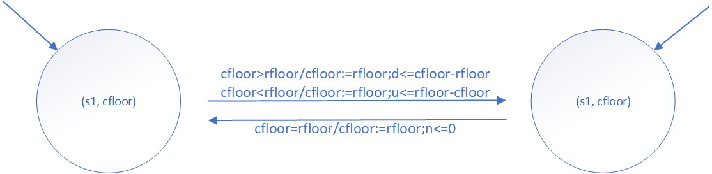
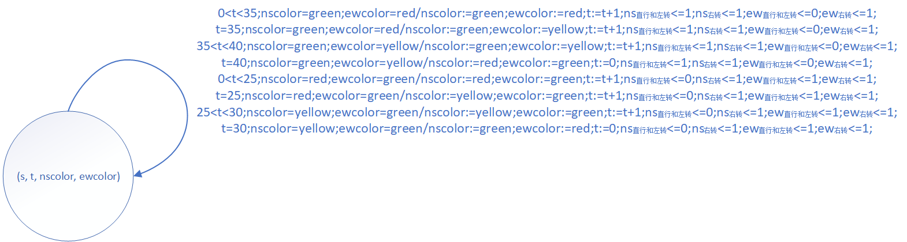
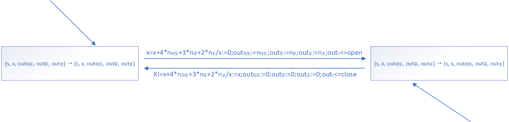

#### 设计下面三题的Mealy型FSMD模型

> 数据有限状态机：带有数据流的有限状态机模型（a finite-state machine with datapath, FSMD）

1. 单部10层电梯控制系统。
   - 状态集 S = {s1}

   - 数据变量集 X: {cfloor, rfloor}

     - cfloor: 存储电梯的楼层当前状态值

     - rfloor: 存储请求要到达的楼层值

   - 控制输入变量集 I~C~: {}

   - 数据输入变量集 I~D~: {rfloor}

   - 数据输入集 {1, 2, 3, 4, 5, 6, 7, 8, 9, 10}

   - 控制输出变量集 O~C~: {d, u, n}

   - 数据输出变量集 O~D~: {cfloor}

   - 转移条件集 TC: {cfloor > rfloor, rfloor > cfloor, rfloor = cfloor}

   - 转移函数 f 和输出函数 h

     - | 状态转移                    | 转移条件        | 数据输出         | 控制输出             |
       | --------------------------- | --------------- | ---------------- | -------------------- |
       | (s1, cfloor) → (s1, cfloor) | cfloor > rfloor | cfloor := rfloor | d <= cfloor - rfloor |
       | (s1, cfloor) → (s1, cfloor) | cfloor < rfloor | cfloor := rfloor | u <= cfloor - rfloor |
       | (s1, cfloor) → (s1, cfloor) | cfloor = rfloor | cfloor := rfloor | n <= 0               |

   - 

   

2. 南北东西两个方向交通路口交通灯正交控制系统：南北方向直行绿灯40秒，东西方向直行绿灯30秒，黄灯5秒，在直行时可以左转，右转始终是自由的。正交控制系统是指南北方向为绿灯时东西方向为红灯，南北方向为红灯时东西方向为绿灯。为了满足安全以及提高通行要求，规定交通灯转换顺序为黄灯-->绿灯-->红灯-->黄灯。

   - 状态集 S = {s}

   - 数据变量集 X: {t, nscolor, ewcolor}

     - t: 记录南北方向时间的计时器

     - nscolor: 南北方向红路灯颜色

     - ewcolor: 东西方向红路灯颜色

   - 控制输入变量集 I~C~: {}

   - 数据输入变量集 I~D~: {t, nscolor, ewcolor}

   - 数据输入集 {0, 1, 2, 3, ...... , 40, green, yellow, red}

   - 控制输出变量集 O~C~: {ns~直行和左转~, ns~右转~, ew~直行和左转~, ew~右转~}

     - 为 1 时表示可以通行

     - 为 0 时表示不可通行

   - 数据输出变量集 O~D~: {nscolor, ewcolor}

   - 转移条件集 TC:

     - ```c
       0 < t < 35; nscolor = green; ewcolor = red
       t = 35; nscolor = green; ewcolor = red
       35 < t < 40; nscolor = green; ewcolor = yellow
       t = 40; nscolor = green; ewcolor = yellow
       0 < t < 25; nscolor = red; ewcolor = green
       t = 25; nscolor = red; ewcolor = green
       25 < t < 30; nscolor = yellow; ewcolor = green
       t = 30; nscolor = yellow; ewcolor = green
       ```

   - 转移函数 f 和输出函数 h

     - | 状态转移                                            | 转移条件                                       | 数据输出                                        | 控制输出                                                     |
       | --------------------------------------------------- | ---------------------------------------------- | ----------------------------------------------- | ------------------------------------------------------------ |
       | (s, t, nscolor, ewcolor) → (s, t, nscolor, ewcolor) | 0 < t < 35; nscolor = green; ewcolor = red     | nscolor := green; ewcolor := red; t := t + 1    | ns~直行和左转~ <= 1; ns~右转~ <= 1; ew~直行和左转~ <= 0; ew~右转~ <= 1; |
       | (s, t, nscolor, ewcolor) → (s, t, nscolor, ewcolor) | t = 35; nscolor = green; ewcolor = red         | nscolor := green; ewcolor := yellow; t := t + 1 | ns~直行和左转~ <= 1; ns~右转~ <= 1; ew~直行和左转~ <= 0; ew~右转~ <= 1; |
       | (s, t, nscolor, ewcolor) → (s, t, nscolor, ewcolor) | 35 < t < 40; nscolor = green; ewcolor = yellow | nscolor := green; ewcolor := yellow; t := t + 1 | ns~直行和左转~ <= 1; ns~右转~ <= 1; ew~直行和左转~ <= 0; ew~右转~ <= 1; |
       | (s, t, nscolor, ewcolor) → (s, t, nscolor, ewcolor) | t = 40; nscolor = green; ewcolor = yellow      | nscolor := red; ewcolor := green; t := 0        | ns~直行和左转~ <= 1; ns~右转~ <= 1; ew~直行和左转~ <= 0; ew~右转~ <= 1; |
       | (s, t, nscolor, ewcolor) → (s, t, nscolor, ewcolor) | 0 < t < 25; nscolor = red; ewcolor = green     | nscolor := red; ewcolor := green; t := t + 1    | ns~直行和左转~ <= 0; ns~右转~ <= 1; ew~直行和左转~ <= 1; ew~右转~ <= 1; |
       | (s, t, nscolor, ewcolor) → (s, t, nscolor, ewcolor) | t = 25; nscolor = red; ewcolor = green         | nscolor := yellow; ewcolor := green; t := t + 1 | ns~直行和左转~ <= 0; ns~右转~ <= 1; ew~直行和左转~ <= 1; ew~右转~ <= 1; |
       | (s, t, nscolor, ewcolor) → (s, t, nscolor, ewcolor) | 25 < t < 30; nscolor = yellow; ewcolor = green | nscolor := yellow; ewcolor := green; t := t + 1 | ns~直行和左转~ <= 0; ns~右转~ <= 1; ew~直行和左转~ <= 1; ew~右转~ <= 1; |
       | (s, t, nscolor, ewcolor) → (s, t, nscolor, ewcolor) | t = 30; nscolor = yellow; ewcolor = green      | nscolor := green; ewcolor := red; t := 0        | ns~直行和左转~ <= 0; ns~右转~ <= 1; ew~直行和左转~ <= 1; ew~右转~ <= 1; |

   - 

   

3. 饮料售货机可以售3种饮料：可乐、茶和水。每瓶可乐售4元、每瓶茶售3元、每瓶水售2元；线上（微信或支付宝）支付。每次可以购买1-3瓶饮料。

   - 状态集 S = {s}

   - 数据变量集 X: {x, n~可乐~, n~茶~, n~水~}

     - x: 记录支付钱数

     - n~可乐~: 可乐的数量

     - n~茶~: 茶的数量

     - n~水~: 水的数量

   - 控制输入变量集 I~C~: {}

   - 数据输入变量集 I~D~: {x, n~可乐~, n~茶~, n~水~}

   - 数据输入集 {2, 3, 4, 5, 6, 7, 8, 9, 10, 11, 12}

   - 控制输出变量集 O~C~: {out~C~}

   - 数据输出变量集 O~D~: {out~可乐~, out~茶~, out~水~}

   - 数据输出集 {open, close}

   - 转移条件集 TC: {x = 4 * n~可乐~ + 3 * out~茶~ + 2 * n~水~, x != 4 * n~可乐~ + 3 * out~茶~ + 2 * n~水~}

   - 转移函数 f 和输出函数 h

     - | 状态转移                                                     | 转移条件                                     | 数据输出                                                     | 控制输出        |
       | ------------------------------------------------------------ | -------------------------------------------- | ------------------------------------------------------------ | --------------- |
       | (s, x, out~可乐~, out~茶~, out~水~) → (s, x, out~可乐~, out~茶~, out~水~) | x = x + 4 * n~可乐~ + 3 * n~茶~ + 2 * n~水~  | x := 0; out~可乐~ := n~可乐~; out~茶~ := n~茶~; out~水~ := n~水~ | out~C~ <= open  |
       | (s, x, out~可乐~, out~茶~, out~水~) → (s, x, out~可乐~, out~茶~, out~水~) | x != x + 4 * n~可乐~ + 3 * n~茶~ + 2 * n~水~ | x := x; out~可乐~ := 0; out~茶~ := 0; out~水~ := 0           | out~C~ <= close |

   - 