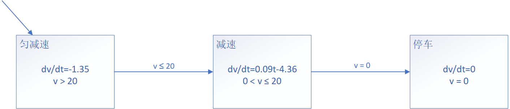
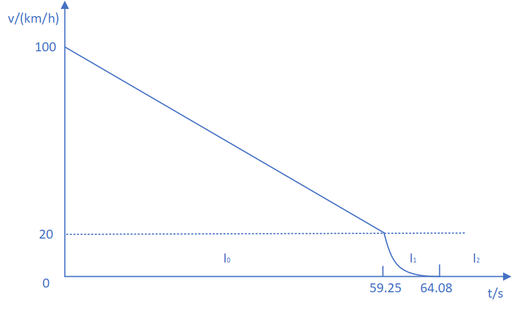
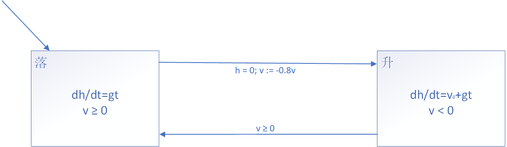
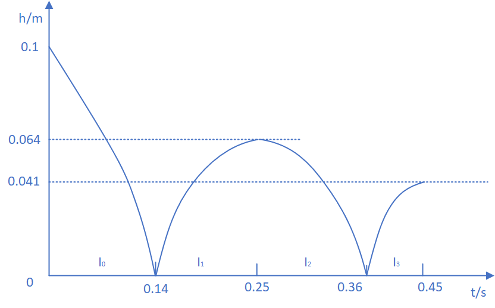

## 1、汽车自动停车系统的混成自动机模型

>  		汽车自动停车系统按照汽车分成三个阶段进行，第一阶段是匀减速行驶， 减速加速度是dv/dt=-1.35（米／秒平方），当车速到达每小时20公里速度时，进入第二阶段，第二阶段也是减速行驶，减速加速度是dv/dt=0.09t-4.36（米／秒平方），当车速到达为零时，汽车进入第三阶段，停车。分别建立关于车速和行车距离的汽车自动停车系统混成自动机模型，并画出它们的演化过程，车速初始速度为100公里/小时。

#### 混成自动机模型

- 离散状态集 Q = {匀减速, 减速, 停车}
- 连续状态集 X = R ，连续变量 v 表示汽车的速度，它是关于时间 t 的函数
- 向量场函数 F(●, ●) : {匀减速, 减速, 停车} × X → R:
  - F(匀减速, v) = (dv/dt=-1.35)，v > 20km/h，匀减速行驶
  - F(减速, v) = (dv/dt=0.09t-4.36)，0km/h < v ≤ 20km/h，减速行驶
  - F(停车, v) = (dv/dt=0)，v = 0km/h，停车
- 初始状态集 Init: {匀减速} × {v∈R|v = 100km/h}
- 域函数 Dom(●) : Q → P(X) 定义为：
  - Dom(匀减速) = {v > 20}，规定匀减速状态速度不低于20km/h
  - Dom(减速) = {0 < v ≤ 20}，规定减速状态速度不低于0km/h，不超过20km/h
  - Dom(停车) = {v = 0}，规定停车状态速度为0km/h
- 边集 E $\subseteq$ Q × Q：
  - 匀减速→减速
  - 减速→停车
- 转换条件 G(●) : E → P(X)：
  - G(匀减速→减速) = {v ≤ 20}，从匀减速状态转化到减速状态的条件是速度不超过20km/h
  - G(减速→停车) = {v = 0}，从减速状态转化到停车状态的条件是速度为0km/h
- 重置映射 R(●, ●) : E × X → P(X)：
  - 为每条边指定空值，即没有重置动作，保留转换状态之前的速度

- 

#### 演化过程

- 开始时间区间 I~0~：汽车匀减速状态，t = 0s，v(0) = 100km/h，经过59.25s后，汽车速度降至20km/h，即v(59.25) = 20km/h，汽车进入减速状态，I~0~ = [0, 59.25]
- 第二个时间区间 I~1~：汽车减速状态，t = 59.25s，v(59,25) = 20km/h，经过4.83s后，汽车速度降至0km/h，即v(64.08) = 0km/h，汽车进入停止状态，I~1~ = [59.25, 64.08]
- 第三个时间区间 I~2~：汽车停止状态，t = 64.08s，v(64.08) = 0km/h，状态不再改变，I~2~ = [64.08, +∞)
- 

## 2、弹跳球运动模型

> ​		让球体在高度h处放下做自由落体运动，当落地时受到下落力作用，球会弹起，速度损失20%，到最高处又会受到地球引力作用做自由落体运动，这样反复落-弹运动，直到球落地不再弹起为止。建立弹跳球运动系统的混成自动机模型，并画出h=100厘米时弹跳球运动演化过程。

#### 混成自动机模型

> 规定：将单位统一换算为m/s，同时假设下落时速度为正，则反弹时速度为负
>
> $ h=v_0t+\frac{1}{2}gt^2 $
>
> $ v=v_0+gt $

- 离散状态集 Q = {落, 升}
- 连续状态集 X = R^2^，连续变量 h 表示球体的高度，连续变量 v 表示球体的高度，它们都是关于速度 v 的函数
- 向量场函数 F(●, ●) : {落, 升} × X → R^2^:
  - F(落, h) = (dh/dt=gt)，v ≥ 0m/s，球体下落
  - F(升, h, v) = (dh/dt=v~0~+gt)，v < 0m/s，球体上升
- 初始状态集 Init: {落} × {h∈R|h = 0.1m}
- 域函数 Dom(●) : Q → P(X) 定义为：
  - Dom(落) = {v ≥ 0}，规定下落时速度为正
  - Dom(升) = {v < 0}，规定反弹时速度为负
- 边集 E $\subseteq$ Q × Q：
  - 落→升
  - 升→落
- 转换条件 G(●) : E → P(X)：
  - G(落→升) = {h = 0}，从落状态转化到升状态的条件是高度为0
  - G(升→落) = {v ≥ 0}，从升状态转化到落状态的条件是速度为正
- 重置映射 R(●, ●) : E × X → P(X)：
  - R(落→升, v) = {v := -0.8v}，从落状态转化为升状态时，需要重置速度损失20%，且速度方向改变

- 

#### 演化过程

- 开始时间区间 I~0~：球体下落，h=0.1m，v = 0m/s，经过0.14s后，球体接触地面，此时速度为1.41m/s，发生重置映射后速度为-1.13m/s，I~0~ = [0, 0.14]0.45
- 第二个时间区间 I~1~：球体反弹，v = -1.13m/s，经过0.11s后，h=0.064m，球体不再上升，此时速度为0m/s，I~1~ = [0.14, 0.25]
- 第三个时间区间 I~2~：球体下落，h=0.064m，v = 0m/s，经过0.11s后，球体接触地面，此时速度为1.13m/s，发生重置映射后速度为-0.90m/s，I~2~ = [0.25, 0.36]
- 第四个时间区间 I~3~：球体反弹，v = -0.90m/s，经过0.09s后，h=0.041m，球体不再上升，此时速度为0m/s，I~3~ = [0.36, 0.45]
- 一直这样重复下去，直到球体静止
- 

