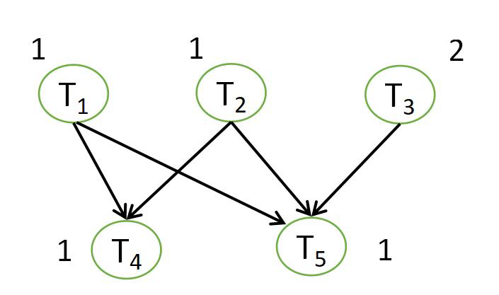
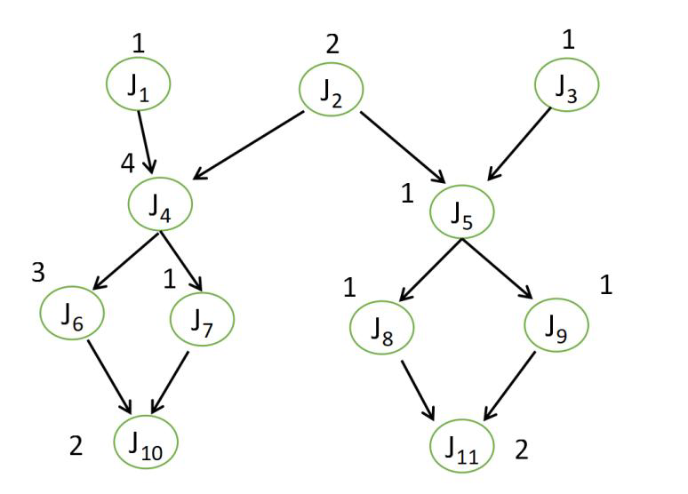

# 1 实验一

## 1.1 实验目的

- 编程实现任务优先级排序算法TaPSA，并求出下列两题的任务优先级表
- (1) 设一系统有5个任务， 任务执行时间与依赖关系如图，其中任务T2释放时间是3，其余释放时间都是0
  - 
- (2) 设一系统含有11个任务，任务执行时间和依赖关系如图，其中 J4的释放时间为4，J8的释放时间为6，其余任务释放时间均为0
  - 

## 1.2 实验过程

### 1.2.1 表征图形数据

- 建立统一的数据输入格式：

  - ```
    格式：
    n - n个任务
    d1...dn - 各个任务执行时间
    t1...tn - 各个任务释放时间
    m n1...nm - 共n行，每行表示一个任务，m表示后继任务数，其中0表示没有后继任务，n1...nm表示后继任务序号
    ```

- 用数据标志图形

  - ```
    (1)表征为输入：
    5
    1 1 2 1 1
    0 3 0 0 0
    2 4 5
    2 4 5
    1 5
    0
    0
    
    (2)表征为输入：
    11
    1 2 1 4 1 3 1 1 1 2 2
    0 0 0 4 0 0 0 6 0 0 0
    1 4
    2 4 5
    1 5
    2 6 7
    2 8 9
    1 10
    1 10
    1 11
    1 11
    0
    0
    ```

### 1.2.2 函数实现TaPSA算法

- ```c++
  #include <cstdio>
  #include <iostream>
  #include <vector>
  #include <algorithm>
  #include <map>
  using namespace std;
  
  typedef struct {
      int time;
      int release;
      int sub;
      int sub_max;
      vector<int> v_pri,v_sub;
  }task;
  task *task_p;
  
  void *read_data(int n) {
      task_p = new task[n+1];
      for(int i = 1;i <= n;i++)
          cin >> task_p[i].time;
      for(int i = 1;i <= n;i++)
          cin >> task_p[i].release;
      for(int i = 1;i <= n;i++) {
          cin >> task_p[i].sub;
          for(int j = 1;j <= task_p[i].sub;j++){
              int task_temp;
              cin >> task_temp;
              task_p[i].v_sub.push_back(task_temp);
              task_p[task_temp].v_pri.push_back(i);
          }
          task_p[i].sub_max = 0;
      }
  }
  
  bool cmp(pair<int, int> a,pair<int, int> b) {
      if(a.second != b.second)
          return a.second > b.second;
      if(task_p[a.first].release != task_p[b.first].release)
          return task_p[a.first].release < task_p[b.first].release;
      if(task_p[a.first].time != task_p[b.first].time)
          return task_p[a.first].time > task_p[b.first].time;
      return a.first < b.first;
  }
  
  void TaPSA(int n) {
      /* Calculate the priority value */
      map<int,int> pri_table;
      for(int i = n;i >= 1;i--) {
          if(task_p[i].sub == 0) {
              pri_table[i] = task_p[i].time;
              int pri_num = task_p[i].v_pri.size();
              while(pri_num--) {
                  int temp = task_p[i].v_pri[pri_num];
                  if(task_p[temp].sub_max < pri_table[i])
                      task_p[temp].sub_max = pri_table[i];
                  auto iter = remove(task_p[temp].v_sub.begin(), task_p[temp].v_sub.end(), i);
                  task_p[temp].v_sub.erase(iter,task_p[temp].v_sub.end());
              }
              continue;
          }
          if(task_p[i].v_sub.size() == 0){
              pri_table[i] = task_p[i].time + task_p[i].sub + task_p[i].sub_max;
              int pri_num = task_p[i].v_pri.size();
              while(pri_num--) {
                  int temp = task_p[i].v_pri[pri_num];
                  if(task_p[temp].sub_max < pri_table[i])
                      task_p[temp].sub_max = pri_table[i];
                  auto iter = remove(task_p[temp].v_sub.begin(), task_p[temp].v_sub.end(), i);
                  task_p[temp].v_sub.erase(iter,task_p[temp].v_sub.end());
              }
          }
      }
      /* sort */
      vector<pair<int, int>> v(pri_table.begin(),pri_table.end());
      sort(v.begin(), v.end(), cmp);
      for(int i=0;i<v.size();i++){
          printf("Task(%d): %d\n",v[i].first, v[i].second);
      }
  }
  
  int main() {
      int n;
      cin >> n;
      read_data(n);
      TaPSA(n);
      delete [] task_p;
      return 0;
  }
  ```

### 1.2.3 程序输出

- ```
  (1)的任务优先级表为：
  Task(3): 4
  Task(1): 4
  Task(2): 4
  Task(4): 1
  Task(5): 1
  
  (2)的任务优先级表为：
  Task(2): 16
  Task(1): 14
  Task(4): 12
  Task(3): 9
  Task(5): 7
  Task(6): 6
  Task(7): 4
  Task(9): 4
  Task(8): 4
  Task(10): 2
  Task(11): 2
  ```

## 1.3 实验结论

- 将上述两个题目的任务优先级表进行人工推导一遍，与程序输出结果一致
- 针对TaPSA算法，上面算法中的图形数据是人工进行表征的，实际上，通过图形建模语言获得相应的表征数据并不是一件难事，也就是说，对于上述程序，只需要加上从图形建模语言获得表征数据的算法，就可以直接从建模通过程序计算得到最终的任务优先级表

# 2 实验二

## 2.1 实验目的

- 编程实现多核划分算法MuPPA，并给出下面两题的划分结果，并计算每个处理器的使用率

- (1) 图中含有5个任务，释放时间都是0，安排在两个处理器P1和P2上执行
  - 

- (2) 将图中11个任务调度到 3个处理器P1，P2和P3，其中 J4的释放时间为4，J8的释放时间为6，其余任务释放时间均为0
  - 

## 2.2 实验过程

### 2.2.1 表征图形数据

- 建立统一的数据输入格式：

  - ```
    格式：
    n p - n个任务，p个处理器
    d1...dn - 各个任务执行时间
    t1...tn - 各个任务释放时间
    m n1...nm - 共n行，每行表示一个任务，m表示后继任务数，其中0表示没有后继任务，n1...nm表示后继任务序号
    ```

- 用数据标志图形

  - ```
    (1)表征为输入：
    5 2
    1 1 2 1 1
    0 0 0 0 0
    2 4 5
    2 4 5
    1 5
    0
    0
    
    (2)表征为输入：
    11 3
    1 2 1 4 1 3 1 1 1 2 2
    0 0 0 4 0 0 0 6 0 0 0
    1 4
    2 4 5
    1 5
    2 6 7
    2 8 9
    1 10
    1 10
    1 11
    1 11
    0
    0
    ```

### 2.2.2 函数实现MuPPA算法

- ```c++
  #include <cstdio>
  #include <iostream>
  #include <vector>
  #include <algorithm>
  #include <map>
  #include <string.h>
  using namespace std;
  
  typedef struct {
      int time;
      int release;
      int sub;
      int sub_max;
      vector<int> v_pri,v_sub;
  }task;
  task *task_p,*task_p_cp;
  
  typedef struct {
      int start;
      int end;
      int task;
  }process;
  process *pro;
  
  void *read_data(int n) {
      task_p = new task[n+1];
      task_p_cp = new task[n+1];
      for(int i = 1;i <= n;i++){
          cin >> task_p[i].time;
          task_p_cp[i].time = task_p[i].time;
      }
      for(int i = 1;i <= n;i++){
          cin >> task_p[i].release;
          task_p_cp[i].release = task_p[i].release;
      }
      for(int i = 1;i <= n;i++) {
          cin >> task_p[i].sub;
          task_p_cp[i].sub = task_p[i].sub;
          for(int j = 1;j <= task_p[i].sub;j++){
              int task_temp;
              cin >> task_temp;
              task_p[i].v_sub.push_back(task_temp);
              task_p[task_temp].v_pri.push_back(i);
              task_p_cp[i].v_sub.push_back(task_temp);
              task_p_cp[task_temp].v_pri.push_back(i);
          }
          task_p[i].sub_max = 0;
          task_p_cp[i].sub_max = 0;
      }
  }
  
  bool cmp(pair<int, int> a,pair<int, int> b) {
      if(a.second != b.second)
          return a.second > b.second;
      if(task_p[a.first].release != task_p[b.first].release)
          return task_p[a.first].release < task_p[b.first].release;
      if(task_p[a.first].time != task_p[b.first].time)
          return task_p[a.first].time > task_p[b.first].time;
      return a.first < b.first;
  }
  
  vector<pair<int, int>> TaPSA(int n) {
      /* Calculate the priority value */
      map<int,int> pri_table;
      for(int i = n;i >= 1;i--) {
          if(task_p[i].sub == 0) {
              pri_table[i] = task_p[i].time;
              int pri_num = task_p[i].v_pri.size();
              while(pri_num--) {
                  int temp = task_p[i].v_pri[pri_num];
                  if(task_p[temp].sub_max < pri_table[i])
                      task_p[temp].sub_max = pri_table[i];
                  auto iter = remove(task_p[temp].v_sub.begin(), task_p[temp].v_sub.end(), i);
                  task_p[temp].v_sub.erase(iter,task_p[temp].v_sub.end());
              }
              continue;
          }
          if(task_p[i].v_sub.size() == 0){
              pri_table[i] = task_p[i].time + task_p[i].sub + task_p[i].sub_max;
              int pri_num = task_p[i].v_pri.size();
              while(pri_num--) {
                  int temp = task_p[i].v_pri[pri_num];
                  if(task_p[temp].sub_max < pri_table[i])
                      task_p[temp].sub_max = pri_table[i];
                  auto iter = remove(task_p[temp].v_sub.begin(), task_p[temp].v_sub.end(), i);
                  task_p[temp].v_sub.erase(iter,task_p[temp].v_sub.end());
              }
          }
      }
      /* sort */
      vector<pair<int, int>> v(pri_table.begin(),pri_table.end());
      sort(v.begin(), v.end(), cmp);
      return v;
  }
  
  void init_process(int p){
      pro = new process[p+1];
      for(int i=1;i <= p;i++)
          pro[i].task=-1;
  }
  
  int get_process(int p) {
      for(int i=1;i <= p;i++){
          if(pro[i].task == -1){
              return i;
          }
      }
      return -1;
  }
  
  void back_process(int p){
      pro[p].task = -1;
  }
  
  void print_process(int p,int cnt){
      for(int i=1;i <= p;i++){
          if(pro[i].task != -1){
              printf("Time{%d}: Task{%d} running in Process{%d}\n",cnt,pro[i].task,i);
          }
      }
  }
  
  void MuPPA(int n, int p, vector<pair<int, int>> v) {
      int cnt=0,num=0,finish_table[n+1];
      vector<int> v_pro[p+1];
      for(int i = 1;i <= n;i++){
          finish_table[i] = -1;
      }
      init_process(p);
      while(num < n+1){
          int cpu = -1,target = 0;
          /* check task */
          for(int i = 1;i <= p;i++) {
              if(pro[i].task != -1){
                  if(cnt >= pro[i].end){
                      /* Sub tasks can be performed */
                      for(int j = 0;j < task_p_cp[pro[i].task].v_sub.size();j++){
                          if(finish_table[task_p_cp[pro[i].task].v_sub[j]] == -2)
                              finish_table[task_p_cp[pro[i].task].v_sub[j]] = -1;
                      }
                      back_process(i);
                      int judge = 1;
                      for(judge = 1;judge <= n;judge++){
                          if(finish_table[judge] != 0)
                              break;
                      }
                      if(judge > n){
                          for(int m = 1;m <= p;m++){
                              int time = 0;
                              cout << "Process " << m << ": ";
                              for(int l = 0;l < v_pro[m].size();l++){
                                  cout << v_pro[m][l] << " ";
                                  time += task_p[v_pro[m][l]].time;
                              }
                              cout << endl;
                              cout << "Process " << m << " utilization rate: ";
                              cout << time << "/" << cnt << endl;
                          }
                          return;
                      }
                  }
              }
          }
          /* perform task*/
          if((cpu=get_process(p)) == -1) {
              print_process(p,cnt);
              cnt++;
          }else{
              for(target = 0;target < v.size();target++) {
                  if(finish_table[v[target].first] == -1)
                      break;
                  if(finish_table[v[target].first] == -2)
                      continue;
                  if(finish_table[v[target].first] > 0){
                      if(cnt >= finish_table[v[target].first])
                          break;
                      else
                          continue;
                  }
              }
              if(target >= v.size()){
                  print_process(p,cnt);
                  cnt++;
              }
              else{
                  int is_finish = 1;
                  if(task_p[v[target].first].v_pri.size() != 0){
                      for(int j = 0;j < task_p[v[target].first].v_pri.size();j++){
                          if(finish_table[task_p[v[target].first].v_pri[j]] != 0){
                              is_finish = 0;
                              break;
                          }else{
                              for(int k = 1;k <= p;k++){
                                  if(pro[k].task == task_p[v[target].first].v_pri[j]){
                                      is_finish = 0;
                                      break;
                                  }
                              }
                          }
                      }
                  }
                  if((task_p[v[target].first].release == 0 || cnt >= task_p[v[target].first].release) && is_finish){
                      pro[cpu].task = v[target].first;
                      pro[cpu].start = cnt;
                      pro[cpu].end = task_p[v[target].first].time + cnt;
                      finish_table[v[target].first] = 0;
                      v_pro[cpu].push_back(v[target].first);
                      num++;
                  }else{
                      if(task_p[v[target].first].release != 0)
                          finish_table[v[target].first] = task_p[v[target].first].release;
                      else
                          finish_table[v[target].first] = -2;  // waiting for pre task
                      continue;
                  }
              }
              if((cpu=get_process(p)) != -1)
                  continue;
              print_process(p,cnt);
              cnt++;
          }
      }
  }
  
  int main() {
      int n,p;
      cin >> n >> p;
      read_data(n);
      vector<pair<int, int>> v = TaPSA(n);
      MuPPA(n, p, v);
      delete [] task_p;
      return 0;
  }
  ```

### 2.2.3 程序输出

- ```
  (1)的MuPPA输出为：
  Time{0}: Task{3} running in Process{1}
  Time{0}: Task{1} running in Process{2}
  Time{1}: Task{3} running in Process{1}
  Time{1}: Task{2} running in Process{2}
  Time{2}: Task{4} running in Process{1}
  Time{2}: Task{5} running in Process{2}
  Process 1: 3 4
  Process 1 utilization rate: 3/3
  Process 2: 1 2 5
  Process 2 utilization rate: 3/3
  
  (2)的MuPPA输出为：
  Time{0}: Task{2} running in Process{1}
  Time{0}: Task{1} running in Process{2}
  Time{0}: Task{3} running in Process{3}
  Time{1}: Task{2} running in Process{1}
  Time{2}: Task{5} running in Process{1}
  Time{3}: Task{9} running in Process{1}
  Time{4}: Task{4} running in Process{1}
  Time{5}: Task{4} running in Process{1}
  Time{6}: Task{4} running in Process{1}
  Time{6}: Task{8} running in Process{2}
  Time{7}: Task{4} running in Process{1}
  Time{7}: Task{11} running in Process{2}
  Time{8}: Task{6} running in Process{1}
  Time{8}: Task{11} running in Process{2}
  Time{8}: Task{7} running in Process{3}
  Time{9}: Task{6} running in Process{1}
  Time{10}: Task{6} running in Process{1}
  Time{11}: Task{10} running in Process{1}
  Time{12}: Task{10} running in Process{1}
  Process 1: 2 5 9 4 6 10
  Process 1 utilization rate: 13/13
  Process 2: 1 8 11
  Process 2 utilization rate: 4/13
  Process 3: 3 7
  Process 3 utilization rate: 2/13
  ```

## 2.3 实验结论

- 将上述两个题目的任务优先级表进行人工推导一遍，与程序输出结果一致
- 针对MuPPA算法，如同TAPSA算法一样，MuPPA算法中的图形数据是人工进行表征的，也就是说，对于上述程序，亦只需要加上从图形建模语言获得表征数据的算法，就可以直接从建模通过程序计算得到最终的多核系统任务划分情况