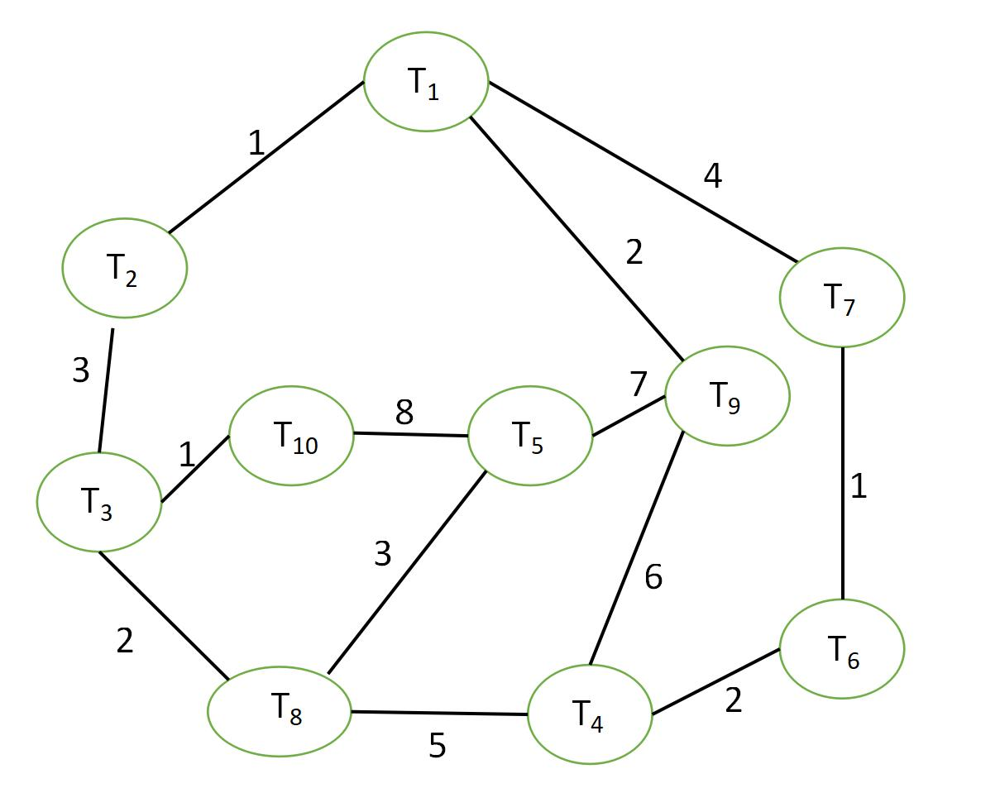
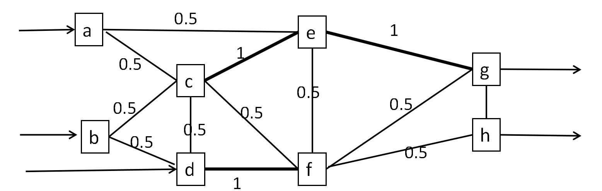
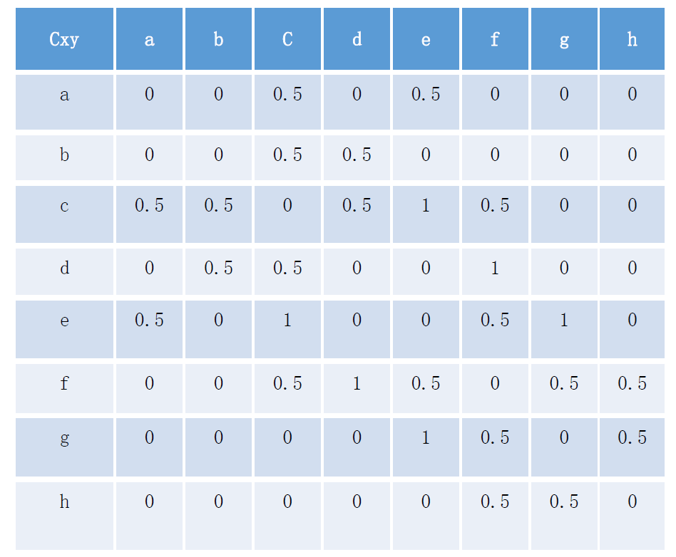

# 1 实验目的
- 编程实现多模块化划分算法MMM（单链接、全链接、均链接），输入是通信代价、模块数、每个模块最大任务数，输出为划分好的模块，并给出划分代价

## 1.1 任务1

- 使用实现的程序将下图的10个任务划分成4个模块，每个块内任务个数不超过3
- 

## 1.2 任务2

- 使用实现的程序将下图中的8个任务a，b，c，d，f，g，h分成2个模块，每个模块含有4个任务，使得模块间通信代价最小，任务间通信代价见下表
- 
- 

# 2 算法设计

- 针对单链接、全链接、均链接实现对应的多模块化划分算法

## 2.1 单链接

- ```c++
  #include <iostream>
  #include <vector>
  #include <map>
  #include <algorithm>
  using namespace std;

  int n;
  map<string,double> mp;
  vector<vector<string>> v;
  typedef struct cluster{
      double weight;
      int k;
      vector<vector<string>> v;
  }Cluster;
  vector<Cluster> ans_v;

  // 读输入数据，建立关系
  double read_data(){
      int edge;
      double weight,max_weight=0;
      string task_i,task_j;
      for(int i = 0;i < n;i++){
          vector<string> temp;
          cin >> task_i >> edge;
          temp.push_back(task_i);
          v.push_back(temp);  // {{"T1"},{"T2"},...}
          for(int j = 0;j < edge;j++){
              cin >> task_j >> weight;
              if(weight > max_weight)
                  max_weight = weight;
              mp[task_i+task_j] = weight;
          }
      }
      return max_weight;
  }

  // 单链接核心部分
  double MuSSA(vector<string> v1,vector<string>v2){
      double larc = 0;
      for(int i = 0;i < v1.size();i++){
          for(int j = 0;j < v2.size();j++){
              if(mp[v1[i]+v2[j]] > larc)
                  larc = mp[v1[i]+v2[j]];
          }
      }
      return larc;
  }

  // 公共部分，遍历逻辑
  void MM(int model_num,int max_task_num,int max_weight,double cost){
      double weight = max_weight + 1;
      int k = v.size();
      Cluster temp;
      temp.weight = weight;
      temp.k = v.size();
      temp.v = v;
      ans_v.push_back(temp);
      weight = weight-1;
      while(weight != 0 && k != model_num){
          bool back = false;
          vector<vector<string>> v_temp;
          for(int i = 0;i < v.size();i++){
              v_temp.push_back(v[i]);
          }
          v.clear();
          for(int i = 0;i < v_temp.size();i++){
              for(int j = i+1;j < v_temp.size();j++){
                  double larc = MuSSA(v_temp[i],v_temp[j]);
                  if(larc >= weight && v_temp[i].size() + v_temp[j].size() <= max_task_num){
                      vector<string> merge_v,tmp_1,tmp_2;
                      for(int k = 0;k < v_temp[i].size();k++){
                          tmp_1.push_back(v_temp[i][k]);
                      }
                      for(int k = 0;k < v_temp[j].size();k++){
                          tmp_2.push_back(v_temp[j][k]);
                      }
                      merge_v.insert(merge_v.end(),v_temp[i].begin(),v_temp[i].end());
                      merge_v.insert(merge_v.end(),v_temp[j].begin(),v_temp[j].end());
                      v.push_back(merge_v);
                      v_temp.erase(remove(v_temp.begin(),v_temp.end(),tmp_1),v_temp.end());
                      v_temp.erase(remove(v_temp.begin(),v_temp.end(),tmp_2),v_temp.end());
                      for(int k = 0;k < v_temp.size();k++){
                          v.push_back(v_temp[k]);
                      }
                      back = true;
                      break;
                  }
              }
              if(back)
                  break;
          }
          if(back)
              continue;
          for(int i = 0;i < v_temp.size();i++){
              v.push_back(v_temp[i]);
          }
          temp.weight = weight;
          temp.k = v.size();
          temp.v = v;
          ans_v.push_back(temp);
          k = v.size();
          weight -= cost;
      }

  }

  // 展示划分结果
  void show_ans(){
      for(int i = 0;i < ans_v.size();i++){
          cout << ans_v[i].weight << " " << ans_v[i].k << " \t{" ;
          for(int j = 0;j < ans_v[i].v.size();j++){
              cout << "{" << ans_v[i].v[j][0];
              for(int k = 1;k < ans_v[i].v[j].size();k++){
                  cout << " " <<  ans_v[i].v[j][k];
              }
              cout << "}";
          }
          cout << "}" << endl;
      }
  }

  double cal(vector<string> v1,vector<string>v2){
      double larc = 0;
      for(int i = 0;i < v1.size();i++){
          for(int j = 0;j < v2.size();j++){
              if(mp[v1[i]+v2[j]] > 0)
                  larc += mp[v1[i]+v2[j]];
          }
      }
      return larc;
  }

  // 计算通信代价
  void cal_cost(){
      double all_cost;
      int dst = ans_v.size() - 1;
      for(int i = 0;i < ans_v[dst].v.size();i++){
          for(int j = i+1;j < ans_v[dst].v.size();j++){
              all_cost += cal(ans_v[dst].v[i],ans_v[dst].v[j]);
          }
      }
      cout << "all cost: " << all_cost << endl;
  }

  int main() {
      int model_num,max_task_num;
      double max_weight,cost;
      cin >> n >> model_num >> max_task_num >> cost;
      max_weight = read_data();
      MM(model_num,max_task_num,max_weight,cost);
      show_ans();
      cal_cost();
      return 0;
  }
  ```

## 2.2 全链接

- ```c++
  #include <iostream>
  #include <vector>
  #include <map>
  #include <algorithm>
  using namespace std;

  int n;
  map<string,double> mp;
  vector<vector<string>> v;
  typedef struct cluster{
      double weight;
      int k;
      vector<vector<string>> v;
  }Cluster;
  vector<Cluster> ans_v;

  // 读输入数据，建立关系
  double read_data(){
      int edge;
      double weight,max_weight=0;
      string task_i,task_j;
      for(int i = 0;i < n;i++){
          vector<string> temp;
          cin >> task_i >> edge;
          temp.push_back(task_i);
          v.push_back(temp);  // {{"T1"},{"T2"},...}
          for(int j = 0;j < edge;j++){
              cin >> task_j >> weight;
              if(weight > max_weight)
                  max_weight = weight;
              mp[task_i+task_j] = weight;
          }
      }
      return max_weight;
  }

  // 单链接核心部分
  double MuSAA(vector<string> v1,vector<string>v2){
      double larc = 0;
      for(int i = 0;i < v1.size();i++){
          for(int j = 0;j < v2.size();j++){
              if(mp[v1[i]+v2[j]] > larc)
                  larc = mp[v1[i]+v2[j]];
          }
      }
      return larc;
  }

  // 全链接核心部分
  double MuCAA(vector<string> v1,vector<string>v2){
      double larc = 999;
      for(int i = 0;i < v1.size();i++){
          for(int j = 0;j < v2.size();j++){
              if(mp[v1[i]+v2[j]] < larc)
                  larc = mp[v1[i]+v2[j]];
          }
      }
      return larc;
  }

  // 公共部分，遍历逻辑
  void MM(int model_num,int max_task_num,int max_weight,double cost, double (*pfun)(vector<string>,vector<string>)){
      double weight = max_weight + 1;
      int k = v.size();
      Cluster temp;
      temp.weight = weight;
      temp.k = v.size();
      temp.v = v;
      ans_v.push_back(temp);
      weight = weight-1;
      while(weight != 0 && k != model_num){
          bool back = false;
          vector<vector<string>> v_temp;
          for(int i = 0;i < v.size();i++){
              v_temp.push_back(v[i]);
          }
          v.clear();
          for(int i = 0;i < v_temp.size();i++){
              for(int j = i+1;j < v_temp.size();j++){
                  double larc = pfun(v_temp[i],v_temp[j]);
                  if(larc >= weight && v_temp[i].size() + v_temp[j].size() <= max_task_num){
                      vector<string> merge_v,tmp_1,tmp_2;
                      for(int k = 0;k < v_temp[i].size();k++){
                          tmp_1.push_back(v_temp[i][k]);
                      }
                      for(int k = 0;k < v_temp[j].size();k++){
                          tmp_2.push_back(v_temp[j][k]);
                      }
                      merge_v.insert(merge_v.end(),v_temp[i].begin(),v_temp[i].end());
                      merge_v.insert(merge_v.end(),v_temp[j].begin(),v_temp[j].end());
                      v.push_back(merge_v);
                      v_temp.erase(remove(v_temp.begin(),v_temp.end(),tmp_1),v_temp.end());
                      v_temp.erase(remove(v_temp.begin(),v_temp.end(),tmp_2),v_temp.end());
                      for(int k = 0;k < v_temp.size();k++){
                          v.push_back(v_temp[k]);
                      }
                      back = true;
                      break;
                  }
              }
              if(back)
                  break;
          }
          if(back)
              continue;
          for(int i = 0;i < v_temp.size();i++){
              v.push_back(v_temp[i]);
          }
          temp.weight = weight;
          temp.k = v.size();
          temp.v = v;
          ans_v.push_back(temp);
          k = v.size();
          weight -= cost;
      }
      if(weight == 0 && k > model_num){
          MM(model_num,max_task_num,max_weight,cost,MuSAA);
      }
  }

  // 展示划分结果
  void show_ans(){
      for(int i = 0;i < ans_v.size();i++){
          cout << ans_v[i].weight << " " << ans_v[i].k << " \t{" ;
          for(int j = 0;j < ans_v[i].v.size();j++){
              cout << "{" << ans_v[i].v[j][0];
              for(int k = 1;k < ans_v[i].v[j].size();k++){
                  cout << " " <<  ans_v[i].v[j][k];
              }
              cout << "}";
          }
          cout << "}" << endl;
      }
  }

  double cal(vector<string> v1,vector<string>v2){
      double larc = 0;
      for(int i = 0;i < v1.size();i++){
          for(int j = 0;j < v2.size();j++){
              if(mp[v1[i]+v2[j]] > 0)
                  larc += mp[v1[i]+v2[j]];
          }
      }
      return larc;
  }

  // 计算通信代价
  void cal_cost(){
      double all_cost;
      int dst = ans_v.size() - 1;
      for(int i = 0;i < ans_v[dst].v.size();i++){
          for(int j = i+1;j < ans_v[dst].v.size();j++){
              all_cost += cal(ans_v[dst].v[i],ans_v[dst].v[j]);
          }
      }
      cout << "all cost: " << all_cost << endl;
  }

  int main() {
      int model_num,max_task_num;
      double max_weight,cost;
      cin >> n >> model_num >> max_task_num >> cost;
      max_weight = read_data();
      MM(model_num,max_task_num,max_weight,cost,MuCAA);
      show_ans();
      cal_cost();
      return 0;
  }
  ```

## 2.3 均链接

- ```c++
  #include <iostream>
  #include <vector>
  #include <map>
  #include <algorithm>
  using namespace std;

  int n;
  map<string,double> mp;
  vector<vector<string>> v;
  typedef struct cluster{
      double weight;
      int k;
      vector<vector<string>> v;
  }Cluster;
  vector<Cluster> ans_v;

  // 读输入数据，建立关系
  double read_data(){
      int edge;
      double weight,max_weight=0;
      string task_i,task_j;
      for(int i = 0;i < n;i++){
          vector<string> temp;
          cin >> task_i >> edge;
          temp.push_back(task_i);
          v.push_back(temp);  // {{"T1"},{"T2"},...}
          for(int j = 0;j < edge;j++){
              cin >> task_j >> weight;
              if(weight > max_weight)
                  max_weight = weight;
              mp[task_i+task_j] = weight;
          }
      }
      return max_weight;
  }

  // 单链接核心部分
  double MuSAA(vector<string> v1,vector<string>v2){
      double larc = 0;
      for(int i = 0;i < v1.size();i++){
          for(int j = 0;j < v2.size();j++){
              if(mp[v1[i]+v2[j]] > larc)
                  larc = mp[v1[i]+v2[j]];
          }
      }
      return larc;
  }

  // 全链接核心部分
  double MuCAA(vector<string> v1,vector<string>v2){
      double larc = 999;
      for(int i = 0;i < v1.size();i++){
          for(int j = 0;j < v2.size();j++){
              if(mp[v1[i]+v2[j]] < larc)
                  larc = mp[v1[i]+v2[j]];
          }
      }
      return larc;
  }

  // 均链接核心部分
  double MuAAA(vector<string> v1,vector<string>v2){
      double larc,all_larc = 0;
      int count = 0;
      for(int i = 0;i < v1.size();i++){
          for(int j = 0;j < v2.size();j++){
              all_larc += mp[v1[i]+v2[j]];
              count++;
          }
      }
      larc = all_larc/count;
      return larc;
  }

  // 公共部分，遍历逻辑
  void MM(int model_num,int max_task_num,int max_weight,double cost, double (*pfun)(vector<string>,vector<string>)){
      double weight = max_weight + 1;
      int k = v.size();
      Cluster temp;
      temp.weight = weight;
      temp.k = v.size();
      temp.v = v;
      ans_v.push_back(temp);
      weight = weight-1;
      while(weight != 0 && k != model_num){
          bool back = false;
          vector<vector<string>> v_temp;
          for(int i = 0;i < v.size();i++){
              v_temp.push_back(v[i]);
          }
          v.clear();
          for(int i = 0;i < v_temp.size();i++){
              for(int j = i+1;j < v_temp.size();j++){
                  double larc = pfun(v_temp[i],v_temp[j]);
                  if(larc >= weight && v_temp[i].size() + v_temp[j].size() <= max_task_num){
                      vector<string> merge_v,tmp_1,tmp_2;
                      for(int k = 0;k < v_temp[i].size();k++){
                          tmp_1.push_back(v_temp[i][k]);
                      }
                      for(int k = 0;k < v_temp[j].size();k++){
                          tmp_2.push_back(v_temp[j][k]);
                      }
                      merge_v.insert(merge_v.end(),v_temp[i].begin(),v_temp[i].end());
                      merge_v.insert(merge_v.end(),v_temp[j].begin(),v_temp[j].end());
                      v.push_back(merge_v);
                      v_temp.erase(remove(v_temp.begin(),v_temp.end(),tmp_1),v_temp.end());
                      v_temp.erase(remove(v_temp.begin(),v_temp.end(),tmp_2),v_temp.end());
                      for(int k = 0;k < v_temp.size();k++){
                          v.push_back(v_temp[k]);
                      }
                      back = true;
                      break;
                  }
              }
              if(back)
                  break;
          }
          if(back)
              continue;
          for(int i = 0;i < v_temp.size();i++){
              v.push_back(v_temp[i]);
          }
          temp.weight = weight;
          temp.k = v.size();
          temp.v = v;
          ans_v.push_back(temp);
          k = v.size();
          weight -= cost;
      }
      if(weight == 0 && k > model_num){
          MM(model_num,max_task_num,max_weight,cost,MuSAA);
      }
  }

  // 展示划分结果
  void show_ans(){
      for(int i = 0;i < ans_v.size();i++){
          cout << ans_v[i].weight << " " << ans_v[i].k << " \t{" ;
          for(int j = 0;j < ans_v[i].v.size();j++){
              cout << "{" << ans_v[i].v[j][0];
              for(int k = 1;k < ans_v[i].v[j].size();k++){
                  cout << " " <<  ans_v[i].v[j][k];
              }
              cout << "}";
          }
          cout << "}" << endl;
      }
  }

  double cal(vector<string> v1,vector<string>v2){
      double larc = 0;
      for(int i = 0;i < v1.size();i++){
          for(int j = 0;j < v2.size();j++){
              if(mp[v1[i]+v2[j]] > 0)
                  larc += mp[v1[i]+v2[j]];
          }
      }
      return larc;
  }

  // 计算通信代价
  void cal_cost(){
      double all_cost;
      int dst = ans_v.size() - 1;
      for(int i = 0;i < ans_v[dst].v.size();i++){
          for(int j = i+1;j < ans_v[dst].v.size();j++){
              all_cost += cal(ans_v[dst].v[i],ans_v[dst].v[j]);
          }
      }
      cout << "all cost: " << all_cost << endl;
  }

  int main() {
      int model_num,max_task_num;
      double max_weight,cost;
      cin >> n >> model_num >> max_task_num >> cost;
      max_weight = read_data();
      MM(model_num,max_task_num,max_weight,cost,MuAAA);
      show_ans();
      cal_cost();
      return 0;
  }
  ```

# 3 实验过程

- 定义数据输入格式
- 执行算法
- 获得结果

## 3.1 数据输入格式

- ```
  n model_num max_task_num cost	n：任务数；model_num：模块数；max_task_num：模块内最大任务数 cost：阈值下降速率
  loop n:
  	Ti k		        Ti：任务i；k：k条边
  	loop k:
  		Tj q	        Tj：与任务i存在关系的任务j；q：两个任务边的权值
  ```

### 3.1.1 表征任务1输入

- ```
  10 4 3 1
  T1 3
  T2 1
  T7 4
  T9 2
  T2 2
  T1 1
  T3 3
  T3 3
  T2 3
  T8 2
  T10 1
  T4 3
  T6 2
  T8 5
  T9 6
  T5 3
  T8 3
  T9 7
  T10 8
  T6 2
  T4 2
  T7 1
  T7 2
  T1 4
  T6 1
  T8 3
  T3 2
  T5 3
  T4 5
  T9 3
  T4 6
  T5 7
  T1 2
  T10 2
  T3 1
  T5 8
  ```

### 3.1.2 表征任务2输入

- ```
  8 2 4 0.5
  a 2
  e 0.5
  c 0.5
  b 2
  c 0.5
  d 0.5
  c 5
  a 0.5
  b 0.5
  d 0.5
  f 0.5
  e 1
  d 3
  b 0.5
  c 0.5
  f 1
  e 4
  a 0.5
  c 1
  f 0.5
  g 1
  f 5
  d 1
  c 0.5
  e 0.5
  g 0.5
  h 0.5
  g 3
  e 1
  f 0.5
  h 0.5
  h 2
  f 0.5
  g 0.5
  ```

## 3.2 实验结果

### 3.2.1 任务1

- 单链接划分结果及代价
  - ```
    9 10    {{T1}{T2}{T3}{T4}{T5}{T6}{T7}{T8}{T9}{T10}}
    8 9     {{T5 T10}{T1}{T2}{T3}{T4}{T6}{T7}{T8}{T9}}
    7 8     {{T5 T10 T9}{T1}{T2}{T3}{T4}{T6}{T7}{T8}}
    6 8     {{T5 T10 T9}{T1}{T2}{T3}{T4}{T6}{T7}{T8}}
    5 7     {{T4 T8}{T5 T10 T9}{T1}{T2}{T3}{T6}{T7}}
    4 6     {{T1 T7}{T4 T8}{T5 T10 T9}{T2}{T3}{T6}}
    3 5     {{T2 T3}{T1 T7}{T4 T8}{T5 T10 T9}{T6}}
    2 4     {{T4 T8 T6}{T2 T3}{T1 T7}{T5 T10 T9}}
    all cost: 16
    ```
- 全链接划分结果及代价
  - ```
    9 10    {{T1}{T2}{T3}{T4}{T5}{T6}{T7}{T8}{T9}{T10}}
    8 9     {{T5 T10}{T1}{T2}{T3}{T4}{T6}{T7}{T8}{T9}}
    7 9     {{T5 T10}{T1}{T2}{T3}{T4}{T6}{T7}{T8}{T9}}
    6 8     {{T4 T9}{T5 T10}{T1}{T2}{T3}{T6}{T7}{T8}}
    5 8     {{T4 T9}{T5 T10}{T1}{T2}{T3}{T6}{T7}{T8}}
    4 7     {{T1 T7}{T4 T9}{T5 T10}{T2}{T3}{T6}{T8}}
    3 6     {{T2 T3}{T1 T7}{T4 T9}{T5 T10}{T6}{T8}}
    2 6     {{T2 T3}{T1 T7}{T4 T9}{T5 T10}{T6}{T8}}
    1 6     {{T2 T3}{T1 T7}{T4 T9}{T5 T10}{T6}{T8}}
    9 6     {{T2 T3}{T1 T7}{T4 T9}{T5 T10}{T6}{T8}}
    8 6     {{T2 T3}{T1 T7}{T4 T9}{T5 T10}{T6}{T8}}
    7 6     {{T2 T3}{T1 T7}{T4 T9}{T5 T10}{T6}{T8}}
    6 6     {{T2 T3}{T1 T7}{T4 T9}{T5 T10}{T6}{T8}}
    5 5     {{T4 T9 T8}{T2 T3}{T1 T7}{T5 T10}{T6}}
    4 5     {{T4 T9 T8}{T2 T3}{T1 T7}{T5 T10}{T6}}
    3 5     {{T4 T9 T8}{T2 T3}{T1 T7}{T5 T10}{T6}}
    2 5     {{T4 T9 T8}{T2 T3}{T1 T7}{T5 T10}{T6}}
    1 4     {{T1 T7 T6}{T4 T9 T8}{T2 T3}{T5 T10}}
    all cost: 18
    ```
- 均链接划分结果及代价
  - ```
    9 10    {{T1}{T2}{T3}{T4}{T5}{T6}{T7}{T8}{T9}{T10}}
    8 9     {{T5 T10}{T1}{T2}{T3}{T4}{T6}{T7}{T8}{T9}}
    7 9     {{T5 T10}{T1}{T2}{T3}{T4}{T6}{T7}{T8}{T9}}
    6 8     {{T4 T9}{T5 T10}{T1}{T2}{T3}{T6}{T7}{T8}}
    5 8     {{T4 T9}{T5 T10}{T1}{T2}{T3}{T6}{T7}{T8}}
    4 7     {{T1 T7}{T4 T9}{T5 T10}{T2}{T3}{T6}{T8}}
    3 6     {{T2 T3}{T1 T7}{T4 T9}{T5 T10}{T6}{T8}}
    2 5     {{T4 T9 T8}{T2 T3}{T1 T7}{T5 T10}{T6}}
    1 5     {{T4 T9 T8}{T2 T3}{T1 T7}{T5 T10}{T6}}
    9 5     {{T4 T9 T8}{T2 T3}{T1 T7}{T5 T10}{T6}}
    8 5     {{T4 T9 T8}{T2 T3}{T1 T7}{T5 T10}{T6}}
    7 5     {{T4 T9 T8}{T2 T3}{T1 T7}{T5 T10}{T6}}
    6 5     {{T4 T9 T8}{T2 T3}{T1 T7}{T5 T10}{T6}}
    5 5     {{T4 T9 T8}{T2 T3}{T1 T7}{T5 T10}{T6}}
    4 5     {{T4 T9 T8}{T2 T3}{T1 T7}{T5 T10}{T6}}
    3 5     {{T4 T9 T8}{T2 T3}{T1 T7}{T5 T10}{T6}}
    2 5     {{T4 T9 T8}{T2 T3}{T1 T7}{T5 T10}{T6}}
    1 4     {{T1 T7 T6}{T4 T9 T8}{T2 T3}{T5 T10}}
    all cost: 18
    ```

### 3.2.2 任务2

- 单链接划分结果及代价
  - ```
    2 8     {{a}{b}{c}{d}{e}{f}{g}{h}}
    1 5     {{d f}{c e g}{a}{b}{h}}
    0.5 2   {{c e g a}{d f b h}}
    all cost: 3
    ```
- 全链接划分结果及代价
  - ```
    2 8     {{a}{b}{c}{d}{e}{f}{g}{h}}
    1 6     {{d f}{c e}{a}{b}{g}{h}}
    0.5 4   {{g h}{c e a}{d f}{b}}
    2 4     {{g h}{c e a}{d f}{b}}
    1 4     {{g h}{c e a}{d f}{b}}
    0.5 2   {{c e a b}{g h d f}}
    all cost: 3
    ```
- 均链接划分结果及代价
  - ```
    2 8     {{a}{b}{c}{d}{e}{f}{g}{h}}
    1 6     {{d f}{c e}{a}{b}{g}{h}}
    0.5 4   {{g h}{c e a}{d f}{b}}
    2 4     {{g h}{c e a}{d f}{b}}
    1 4     {{g h}{c e a}{d f}{b}}
    0.5 2   {{c e a b}{g h d f}}
    all cost: 3
    ```

# 4 实验结论

- 从实验结果看，单链接相较于全链接和均链接有更少的通信代价开销
- 对于任务1，虽然均链接和全链接的最终划分结果和划分代价一致，但是，可以从划分情况看到，实际上，划分过程是不一致的，但是由于均链接和全链接均无法完成独立完成整个划分过程，最终仍然需要落实到单链接的方式，导致最终划分结果一致
- 对于两个模型的多模块划分结果，可以看到单链接总是能独立完成，而均链接和全链接至少在此任务中无法实现独立划分，增大了开销，降低了效率