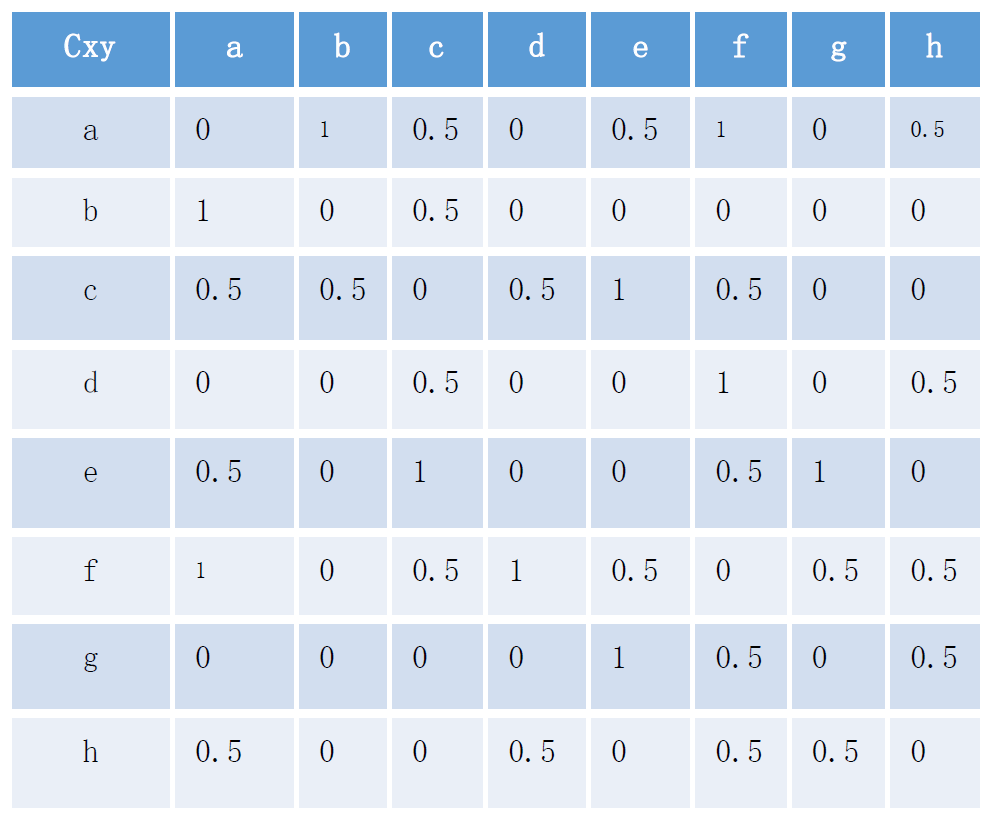
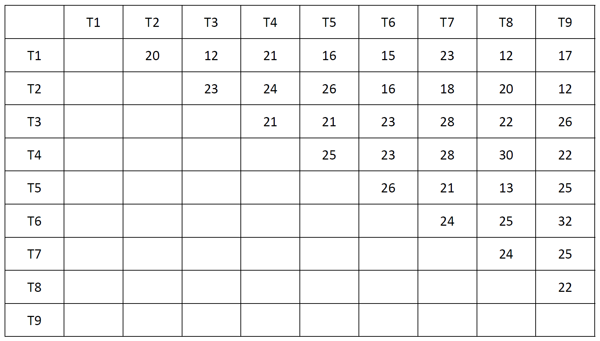
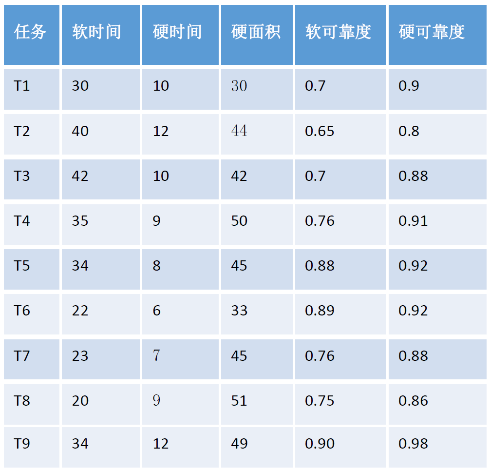

# 1 实验目的

## 1.1 任务1

- 编程实现KL算法，对下表中的任务a，b，c，d，f，g，h选取至少3组不同的初始划分进行2式划分，并计算划分代价，从中选择一个最优划分方案，其中表中数字为通信代价
- 

## 1.2 任务2

- 设计一个方案， 将9个任务分到3个模块，使得每个模块最少包含2个任务，并且使得每个模块的硬件面积不超过80，计算划分方案后整个系统的性能，使得系统的可靠度最高。模块划分算法使用MMM划分算法，其中链接使用单链接、全链接和均链接各进行一次，并比较结果，给出最好的划分方案
- 
- 

# 2 算法设计

## 2.1 任务1 — 2式划分

- 对任务邻接矩阵进行数据处理，并读入

- 使用当前时间初始化随机数种子，对任务进行随机初始划分

- 使用休眠函数，防止速度太快会导致随机数种子没有得到更新

- 对划分好的任务调用 KL 算法，并求出 3 组中最优划分方案

- ```c++
  #include<iostream>
  #include<string>
  #include<vector>
  #include<map>
  #include<ctime>
  #include<cstdlib>
  #include<windows.h>
  #include<algorithm>
  using namespace std;
  
  int n;
  map<string, double> mp,d;
  vector<string> v,va,vb,ans_a,ans_b;
  vector<double> vg;
  
  // 读数据
  void read_data(){
      cin >> n;
      for(int i = 0;i < n;i++){
          string t,tk;
          int k;
          cin >> t >> k;
          v.push_back(t);
          for(int j = 0;j < k;j++){
              double cost;
              cin >> tk >> cost;
              mp[t+tk] = cost;
          }
      }
  }
  
  // 随机初始划分
  void random_partition(){
      va.clear();
      vb.clear();
      vector<string> v_temp;
      for(int i = 0;i < n;i++){
          v_temp.push_back(v[i]);
      }
      srand((unsigned)time(NULL));    // 使用当前时间初始化随机数种子
      for(int i = n;i > n/2;i--){
          int random = rand() % i;
          va.push_back(v_temp[random]);
          v_temp.erase(v_temp.begin()+random);
      }
      cout << "Results after random partition:" << endl;
      cout << "va: ";
      for(int i = 0;i < n/2;i++){
          cout << va[i] << " ";
      }
      cout << endl;
      for(int i = 0;i < n/2;i++){
          vb.push_back(v_temp[i]);
      }
      cout << "vb: ";
      for(int i = 0;i < n/2;i++){
          cout << vb[i] << " ";
      }
      cout << endl;
  }
  
  // 计算D值
  void cal_d(vector<string> a, vector<string> b){
      for(int i = 0;i < a.size();i++){
          string t = a[i];
          double in = 0,out = 0;
          for(int j = 0;j < b.size();j++){
              out += mp[t+b[j]];
          }
          for(int j = 0;j < a.size();j++){
              in += mp[t+a[j]];
          }
          d[t] = out-in;
      }
  }
  
  // 计算G值
  void cal_g(vector<string> &a, vector<string> &b){
      double max = d[a[0]]+d[b[0]]-2*mp[a[0]+b[0]];
      int index_a = 0,index_b = 0;
      for(int i = 0;i < a.size();i++){
          string t = a[i];
          for(int j = 0;j < b.size();j++){
              double g = d[t]+d[b[j]]-2*mp[t+b[j]];
              if(g > max){
                  max = g;
                  index_a = i;
                  index_b = j;
              }
          }
      }
      ans_a.push_back(a[index_a]);
      ans_b.push_back(b[index_b]);
      vg.push_back(max);
      a.erase(a.begin()+index_a);
      b.erase(b.begin()+index_b);
  }
  
  // KL算法
  void kl_algorithm(){
      vector<string> va_temp,vb_temp;
      for(int i = 0;i < n/2;i++){
          va_temp.push_back(va[i]);
          vb_temp.push_back(vb[i]);
      }
      cal_d(va_temp,vb_temp);
      cal_d(vb_temp,va_temp);
      for(int i = 0;i < n/2;i++){
          cal_g(va_temp,vb_temp);
          d.clear();
          cal_d(va_temp,vb_temp);
          cal_d(vb_temp,va_temp);
      }
      double max_g = 0;
      int k = 0;
      for(int i = 0;i < vg.size();i++){
          if(vg[i] < 0){
              k = i-1;
              break;
          }
          max_g += vg[i];
      }
      if(max_g > 0){
          vg.clear();
          d.clear();
          for(int i = 0;i <= k;i++){
              va.push_back(ans_b[i]);
              auto it = find(vb.begin(),vb.end(),ans_b[i]);
              vb.erase(it);
          }
          for(int i = 0;i <= k;i++){
              vb.push_back(ans_a[i]);
              auto it = find(va.begin(),va.end(),ans_a[i]);
              va.erase(it);
          }
          ans_a.clear();
          ans_b.clear();
          kl_algorithm();
      }else{
          cout << "Final partition result:" << endl;
          cout << "va: ";
          for(int i = 0;i < va.size();i++){
              cout << va[i] << " ";
          }
          cout << endl;
          cout << "vb: ";
          for(int i = 0;i < vb.size();i++){
              cout << vb[i] << " ";
          }
          cout << endl;
          ans_a.clear();
          ans_b.clear();
          vg.clear();
          d.clear();
      }
  }
  
  // 计算通信代价
  double cal_cost(){
      double larc = 0;
      for(int i = 0;i < va.size();i++){
          for(int j = 0;j < vb.size();j++){
              if(mp[va[i]+vb[j]] > 0)
                  larc += mp[va[i]+vb[j]];
          }
      }
      return larc;
  }
  
  int main() {
      read_data();
      for(int i = 0;i < 3;i++){
          if(i != 0){
              Sleep(1000);    // 速度太快会导致随机数种子没有得到更新，所以休眠 1s
          }
          random_partition();
          cout << "Original communication cost: " << cal_cost() << endl;
          kl_algorithm();
          cout << "Communication cost after partition: " << cal_cost << endl;
          cout << endl;
      }
      return 0;
  }
  ```

## 2.2 任务2 — 基于MMM的任务划分

- 代码在复用上一次作业中的MMM算法的基础上，针对本次作业进行了一点修改

  - 修改模块内最大任务数为模块内最小任务数

  - 修改读入数据部分

- ```c++
  ```

# 3 实验过程

## 3.1 任务1数据处理

- ```
  n		// 表示 n 组任务
  loop n:
    t k		// 表示第 t 个任务，有 k 条代价边
    loop k:
        tk c	// 表示存在代价边的第 tk 个任务和代价 c	
  ```

- ```
  8
  a 5
  b 1
  c 0.5
  e 0.5
  f 1
  h 0.5
  b 2
  a 1
  c 0.5
  c 5
  a 0.5
  b 0.5
  d 0.5
  e 1
  f 0.5
  d 3
  c 0.5
  f 1
  h 0.5
  e 4
  a 0.5
  c 1
  f 0.5
  g 1
  f 6
  a 1
  c 0.5
  d 1
  e 0.5
  g 0.5
  h 0.5
  g 3
  e 1
  f 0.5
  h 0.5
  h 4
  a 0.5
  d 0.5
  f 0.5
  g 0.5
  ```

## 3.2 任务1实验结果

- ```
  Results after random partition:
  va: a d f b
  vb: c e g h
  Original communication cost: 5
  Final partition result:
  va: d f h g
  vb: c e b a
  Communication cost after partition: 1
  
  Results after random partition:
  va: e g d a
  vb: b c f h
  Original communication cost: 7.5
  Final partition result:
  va: e b c a
  vb: f h d g
  Communication cost after partition: 1
  
  Results after random partition:
  va: h b g a
  vb: c d e f
  Original communication cost: 5
  Final partition result:
  va: b a e c
  vb: d f h g
  Communication cost after partition: 1
  ```

## 3.3 任务2方案设计

- 首先使用MMM算法划分模块，将9个任务划分成3个模块，每个模块最少包含2个任务，其中，单链接、全链接、均链接各进行一次

- 使用LINGO工具对每一个模块进行软硬件划分，并计算其属性，要求每个模块的硬件面积不超过80的约束下，模块的可靠度最高

- 由于各模块的可靠度最高，因此此时系统整体的可靠度也最高，计算系统整体的可靠度

## 3.4 任务2数据处理（此处可能要修改算法为最小任务数）

- ```
  n model_num max_task_num cost n：任务数；model_num：模块数；max_task_num：模块内最大任务数 cost：阈值下降速率
  loop n:
    Ti k Ti：任务i；k：k条边
    loop k:
      Tj q Tj：与任务i存在关系的任务j；q：两个任务边的权值
  ```

- ```
  9 3 2 1
  T1 8
  T2 20
  T3 12
  T4 21
  T5 16
  T6 15
  T7 23
  T8 12
  T9 17
  T2 7
  T3 23
  T4 24
  T5 26
  T6 16
  T7 18
  T8 20
  T9 12
  T3 6
  T4 21
  T5 21
  T6 23
  T7 28
  T8 22
  T9 26
  T4 5
  T5 25
  T6 23
  T7 28
  T8 30
  T9 22
  T5 4
  T6 26
  T7 21
  T8 13
  T9 25
  T6 3
  T7 24
  T8 25
  T9 32
  T7 2
  T8 24
  T9 25
  T8 1
  T9 22
  T9 0
  ```

## 3.5 任务2实验结果

### 3.5.1 MMM算法划分结果

### 3.5.2 线性规划划分结果

# 4 实验结论

## 4.1 任务1

- 从任务1的实验结果来看，对于初始划分不同的任务来说，会有不同的初始通信代价，就本次实验数据来说，初始通信代价最大为7.5，经过100余次测试发现，目前已知最大初始通信代价为8.5

  - ```
    Results after random partition:
    va: f e h b
    vb: a c d g
    Original communication cost: 8.5
    Final partition result:
    va: f h d g
    vb: c e b a
    Communication cost after partition: 1
    ```

- 由于我的初始划分采用完全随机的方式，故我可以在不修改输入的情况下，多次随机化测试，经过100余次测试发现，对于不同的初始划分和不同的初始通信代价，最终通信代价都为1，实验表明KL 算法给出的划分通信代价极小化是最好的，进一步也验证了Kernighan与Lin在文献中表明KL算法有极大的可能性获得整体极小划分，对于本实验来说，整体极小划分有极大可能为1

## 4.2 任务2