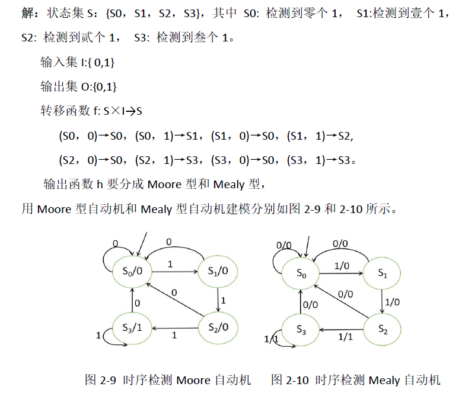
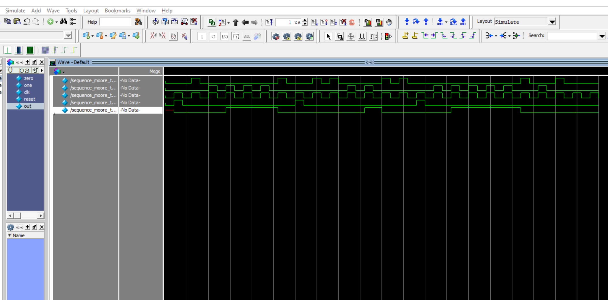
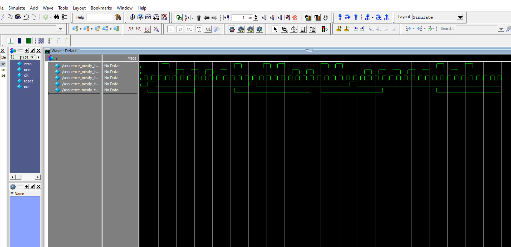
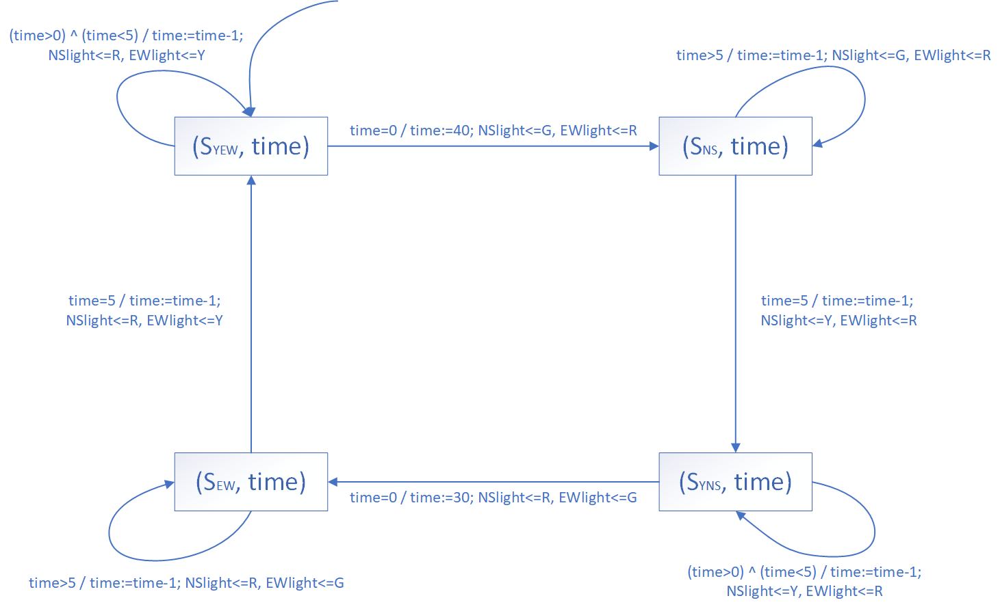
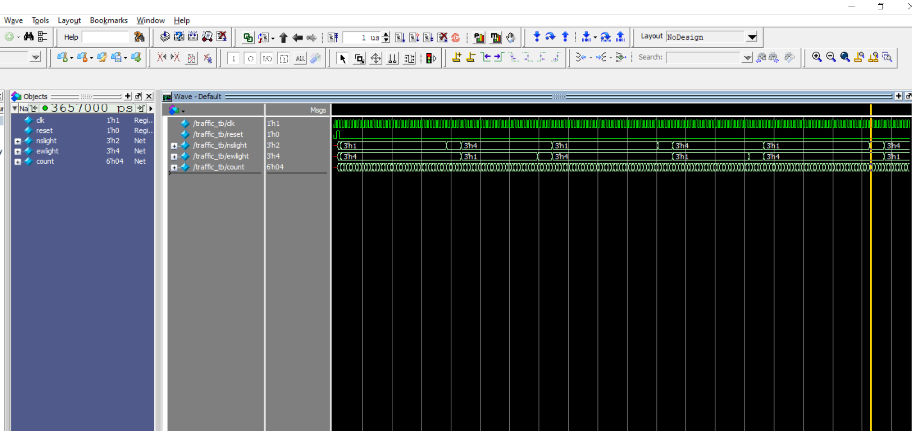
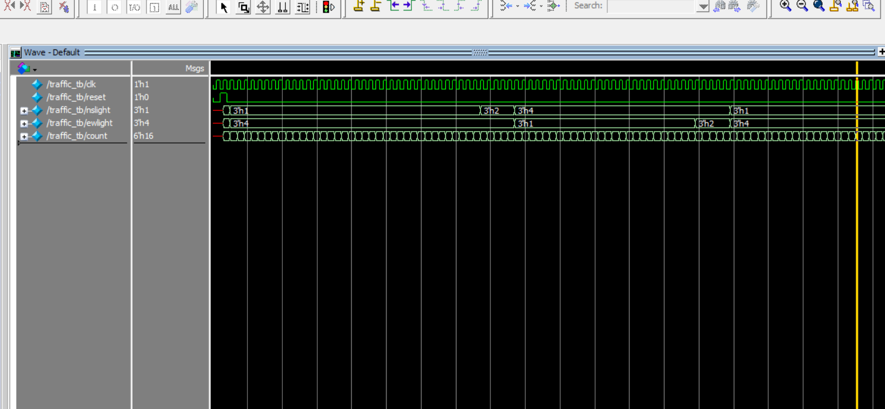

**3.1** 对例2.6时序检测器（Sequence）系统分别进行Moore型自动机模型和Mealy型自动机模型的Modelsim仿真。将模型、仿真代码和仿真结果写成实验报告。

> 一个时序检测器实现在接收连续 3 个 1 后输出 1， 其它情况输出 0

- 模型
  - 

- 时序检测Moore自动机

  - 仿真代码

    - ```verilog
      // 仿真文件代码
      module sequence_moore(zero,one,clk,reset,out);
      	input zero,one,clk,reset;
      	output out;
      	reg [1:0] state;
      	parameter S0=2'b00,S1=2'b01,S2=2'b10,S3=2'b11;
          always @(posedge zero or posedge one or posedge state or posedge reset)
      	if(reset) state<=S0;
      	else
      		case(state)
      			S0:if(zero) state<=S0;
      				else if(one) state<=S1;
      					else state<=S0;
      			S1:if(zero) state<=S0;
      				else if(one) state<=S2;
      					else state<=S1;
      			S2:if(zero) state<=S0;
      				else if(one) state<=S3;
      					else state<=S2;
      			S3:if(zero) state<=S0;
      				else if(one) state<=S3;
      					else state<=S3;
      		endcase
      	assign out=(state==S3)?1:0;
      endmodule 
      ```

    - ```verilog
      // 测试代码
      `timescale 1ns/100ps
      module sequence_moore_tb;
      	reg zero,one,clk,reset;
      	wire out;
      	always #20 clk=~clk;
      	initial
      		begin
      			clk=0;
      			reset=0;
      			zero=0;
      			one=0;
      			#20 reset=1;
      			#20 reset=0;
      			#20 zero=1;
      			#20 zero=0;
      			#20 one=1;
      			#20 one=0;
      			#20 one=1;
      			#20 one=0;
      			#20 one=1;
      			#20 one=0;
      			#20 one=1;
      			#20 one=0;
      			#20 zero=1;
      			#20 zero=0;
      			#20 reset=1;
      			#20 reset=0;
      			#20 zero=1;
      			#20 zero=0;
      			#20 zero=1;
      			#20 zero=0;
      			#20 one=1;
      			#20 one=0;
      			#20 one=1;
      			#20 one=0;
      			#20 zero=1;
      			#20 zero=0;
      			#20 zero=1;
      			#20 zero=0;
      			#20 reset=1;
      			#20 reset=0;
      			#20 one=1;
      			#20 one=0;
      			#20 one=1;
      			#20 one=0;
      			#20 one=1;
      			#20 one=0;
      			#20 one=1;
      			#20 one=0;
      			#20 one=1;
      			#20 one=0;
      			#20 zero=1;
      			#20 zero=0;
      			#20 one=1;
      			#20 one=0;
      			#20 zero=1;
      			#20 zero=0;
      		end
      	sequence_moore
      	sequence_moore(.zero(zero),.one(one),.clk(clk),.reset(reset),.out(out));
      endmodule 
      ```

  - 仿真结果

    - 
    - 由 simulation 可以看到，当 one 信号第三次持续出现时，输出 out 为 1 ，其他情况，输出 out 为 0 ，clk上升沿触发

- 时序检测Mealy自动机

  - 仿真代码

    - ```verilog
      // 仿真文件代码
      module sequence_mealy(zero,one,clk,reset,out);
      	input zero,one,clk,reset;
      	output out;
      	reg [1:0] state,nstate;
      	reg out;
      	parameter S0=2'b00,S1=2'b01,S2=2'b10,S3=2'b11;
      	always @(zero or one or state or reset)
      	if(reset)begin nstate<=S0;out<=0;end 
      	else case(state)
      		S0:begin
      			out<=0;
      			if(zero) nstate<=S0;
      			else if(one) nstate<=S1;
      			else nstate<=S0;
      		end
      		S1:begin 
      			out<=0;
      			if(zero) nstate<=S0;
      			else if(one) nstate<=S2;
      			else nstate<=S1;
      		end
      		S2:begin
      			if(zero)begin out<=0;nstate<=S0;end
      			else if(one)begin out<=1;nstate<=S3;end
      			else nstate<=S2;
      		end
      		S3:begin
      			if(zero)begin out<=0;nstate<=S0;end
      			else if(one)begin out<=1;nstate<=S3;end
      			else nstate<=S3;
      		end
      	endcase 
      	always @(posedge clk) state<=nstate;
      endmodule 
      ```

    - ```verilog
      // 测试代码
      `timescale 1ns/100ps
      module sequence_mealy_tb;
      	reg zero,one,clk,reset;
      	wire out;
      	always #10 clk=~clk;
      	initial
      		begin
      			clk=0;
      			reset=0;
      			zero=0;
      			one=0;
      			#20 reset=1;
      			#20 reset=0;
      			#20 zero=1;
      			#20 zero=0;
      			#20 one=1;
      			#20 one=0;
      			#20 one=1;
      			#20 one=0;
      			#20 one=1;
      			#20 one=0;
      			#20 one=1;
      			#20 one=0;
      			#20 zero=1;
      			#20 zero=0;
      			#20 reset=1;
      			#20 reset=0;
      			#20 zero=1;
      			#20 zero=0;
      			#20 zero=1;
      			#20 zero=0;
      			#20 one=1;
      			#20 one=0;
      			#20 one=1;
      			#20 one=0;
      			#20 zero=1;
      			#20 zero=0;
      			#20 zero=1;
      			#20 zero=0;
      			#20 reset=1;
      			#20 reset=0;
      			#20 one=1;
      			#20 one=0;
      			#20 one=1;
      			#20 one=0;
      			#20 one=1;
      			#20 one=0;
      			#20 one=1;
      			#20 one=0;
      			#20 one=1;
      			#20 one=0;
      			#20 zero=1;
      			#20 zero=0;
      			#20 one=1;
      			#20 one=0;
      			#20 zero=1;
      			#20 zero=0;
      		end
      	sequence_mealy
      	sequence_mealy(.zero(zero),.one(one),.clk(clk),.reset(reset),.out(out));
      endmodule 
      ```

  - 仿真结果

    - 
    - 由 simulation 可以看到，当 one 信号第三次持续出现时，输出 out 为 1 ，其他情况，输出 out 为 0 ，clk上升沿触发


**3.3** 使用Modelsim仿真工具对交通路口红绿灯控制系统进行建模仿真。该南北东西两个方向交通路口红绿灯正交控制系统：南北方向直行绿灯40秒，东西方向直行绿灯30秒，在直行时可以左转，右转始终是自由的。绿灯到红灯的转换需经过黄灯，黄灯时间为5秒，而红灯直接转到绿灯。初始状态为东西和南北都是黄灯。（正交控制系统是指南北方向为绿灯时东西方向为红灯，南北方向为红灯时东西方向为绿灯。）将模型、仿真代码和仿真结果写成实验报告。

- 模型

  - 状态集 S = {S~NS~, S~EW~, S~YNS~, S~YEW~}

    - S~NS~：南北方向行驶
    - S~EW~：东西方向行驶
    - S~YNS~：南北方向黄灯等待
    - S~YEW~：东西方向黄灯等待

  - 数据变量集 X: {time}

  - 控制输入变量集 I~C~: {}

  - 数据输入变量集 I~D~: {time}

  - 数据输入集 {0, 1, 2, 3, ...... , 40}

  - 控制输出变量集 O~C~: {NSlight, EWlight} NSlight, EWlight [G,R,Y]

  - 数据输出变量集 O~D~: {time}

  - 转移条件集 TC: {time=0, (time>0) ^ (time<5), time=5, time>5}

  - 转移函数 f 和输出函数 h

    - | 状态转移                        | 转移条件            | 数据输出；控制输出                       |
      | ------------------------------- | ------------------- | ---------------------------------------- |
      | (S~YEW~, time) → (S~NS~, time)  | time=0              | time:=40;<br>NSlight<=G, EWlight<=R      |
      | (S~NS~, time) → (S~NS~, time)   | time>5              | time:=time-1;<br/>NSlight<=G, EWlight<=R |
      | (S~NS~, time) → (S~YNS~, time)  | time=5              | time:=time-1;<br/>NSlight<=Y, EWlight<=R |
      | (S~YNS~, time) → (S~YNS~, time) | (time>0) ^ (time<5) | time:=time-1;<br/>NSlight<=Y, EWlight<=R |
      | (S~YNS~, time) → (S~EW~, time)  | time=0              | time:=30;<br/>NSlight<=R, EWlight<=G     |
      | (S~EW~, time) → (S~EW~, time)   | time>5              | time:=time-1;<br/>NSlight<=R, EWlight<=G |
      | (S~EW~, time) → (S~YEW~, time)  | time=5              | time:=time-1;<br/>NSlight<=R, EWlight<=Y |
      | (S~YEW~, time) → (S~YEW~, time) | (time>0) ^ (time<5) | time:=time-1;<br/>NSlight<=R, EWlight<=Y |

  - 初始状态

    - NSlight<=Y, EWlight<=G

  - 

- 仿真代码

  - ```verilog
    // 仿真文件代码
    module traffic(clk,reset,nslight,ewlight,count);
    	input clk,reset;
    	output nslight,ewlight,count;
    	reg [1:0] state;
        // 计时器，最大值40s，用6bit表示
    	reg [5:0] count;
    	reg [2:0] nslight,ewlight;
    	parameter SYEW=2'b00,SNS=2'b01,SYNS=2'b10,SEW=2'b11;
        // 100表示红灯、010表示黄灯、001表示绿灯，此处也可以用2bit表示三种颜色
    	parameter R=3'b100,Y=3'b010,G=3'b001;
    	always @(posedge clk)begin
    	if(reset)begin count<='d0;state<=SYEW;nslight<=Y;ewlight<=Y;end
    	else case(state)
    		SYEW:begin
    			if(count == 'd0)begin count<='d40;state<=SNS;nslight=G;ewlight=R;end
    			else begin count<=count-1;nslight=R;ewlight=Y;end
    		end
    		SNS:begin
    			if(count == 'd5)begin count<=count-1;state<=SYNS;nslight=Y;ewlight=R;end
    			else begin count<=count-1;nslight=G;ewlight=R;end
    		end
    		SYNS:begin
    			if(count == 'd0)begin count<='d30;state<=SEW;nslight=R;ewlight=G;end
    			else begin count<=count-1;nslight=Y;ewlight=R;end
    		end
    		SEW:begin
    			if(count == 'd5)begin count<=count-1;state<=SYEW;nslight=R;ewlight=Y;end
    			else begin count<=count-1;nslight=R;ewlight=G;end
    		end
    	endcase
    	end
    endmodule
    ```

  - ```verilog
    // 测试代码
    `timescale 1ns/100ps
    module traffic_tb;
    	reg clk,reset;
    	wire [2:0] nslight,ewlight;
    	wire [5:0] count;
    	always #10 clk=~clk;
    	initial begin
    		clk=0;
    		reset=0;
    		#20 reset=1;
        		#20 reset=0;
    	end
    	traffic
    	traffic(.clk(clk),.reset(reset),.nslight(nslight),.ewlight(ewlight),.count(count));
    endmodule
    ```

- 仿真结果

  - 
  - 
  - 由仿真结果可以看到，当给一个 reset 信号之后，模型开始按照设定的状态开始运行，其中
    - count 为计时器，按照指定的频率计数
    - nslight、ewlight中：
      - 1 表示绿灯，对应 001
      - 2 表示黄灯，对应 010
      - 4 表示红灯，对应 100