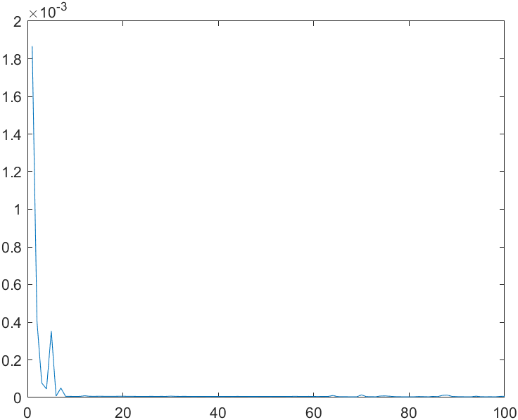
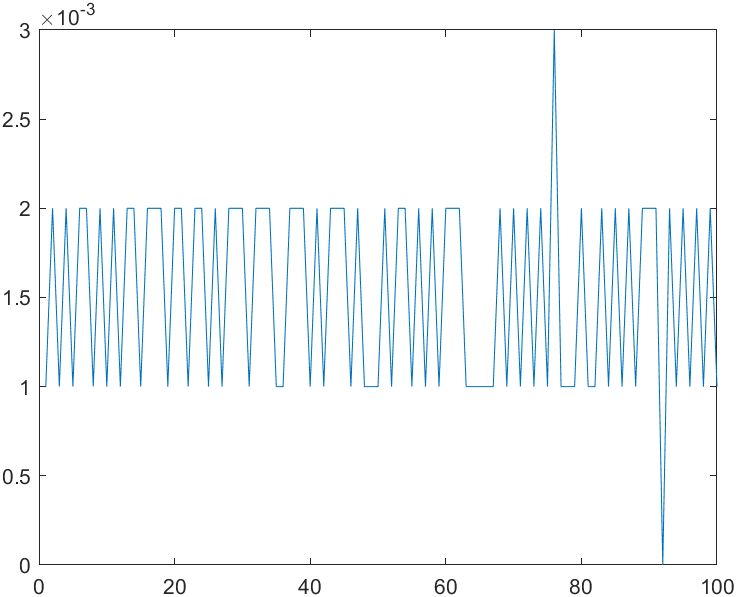
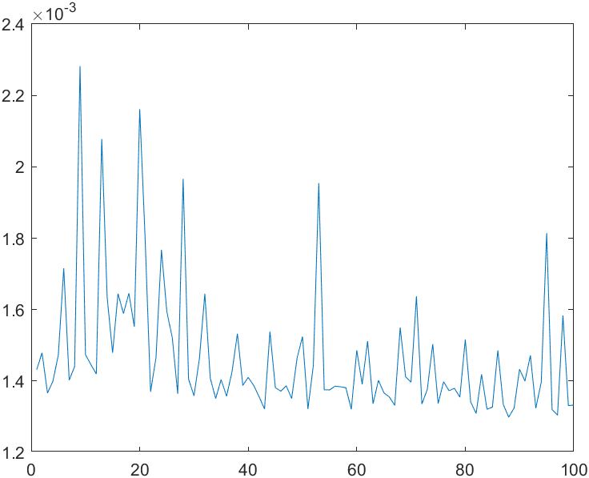
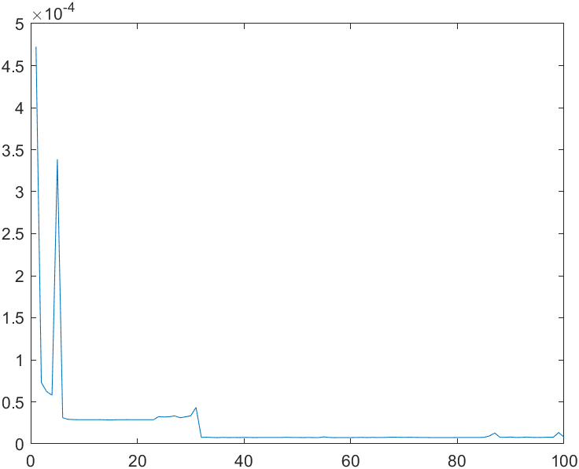
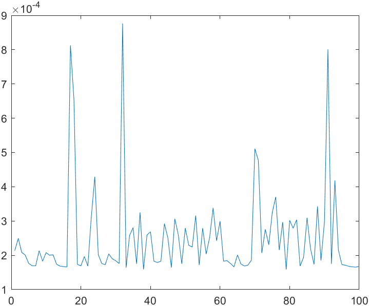

# 第七次作业

### 第一题
> 4.1 分别使用 Matlab 工具和 C++ 语言获得计算下列算法的最大时间，最小时间及平均时间,以及相应的软件功耗：

> > (1) 请实现对一维数组[3,4,1,8,0,5,14,10,12,20,23,24,2,17,6,18,9,19]的排序。（请勿使用 Matlab 自带的 sort 函数。建议使用冒泡、快排等常用算法。）

##### 实验过程

- 同一个程序在多次运行时所产生的执行时间是不同的，而且相差较大。因此，可以多运行几次记录最大执行时间和最小执行时间以及平均时间，作为软件运行时间的属性值。本实验采用记录100次运行时间，并对其求得最大时间、最小时间、平均时间

- Matlab

  - ```matlab
    t = 1:100;
    for i = 1:100
    	a = [3,4,1,8,0,5,14,10,12,20,23,24,2,17,6,18,9,19];
    	tic
    	for j = 1:17
    		for k = 1:18-j
    			if(a(k) > a(k+1))
    				a(k) = a(k) + a(k+1);
    				a(k+1)=a(k)-a(k+1);
    				a(k)=a(k)-a(k+1);
    			end
    		end
    	end
    	a;
    	t(i) = toc
    end
    min=t(1);
    max=t(1);
    avg=t(1);
    for k = 2:100
    	if(t(k) < min)
    		min = t(k);
    	end
    	if (t(k) > max)
    		max = t(k);
    	end
    	avg = avg + t(k);
    end
    min
    max
    avg=avg/100
    ```

  - ```matlab
    min = 3.5000e-06
    max = 0.0019
    avg = 3.3314e-05
    ```

  - ```txt
    软件功耗：我的CPU是AMD R7 5800H，热设计功耗为45w，把热设计功耗的10%作为程序运行产生的单位功耗，给出软件运行功耗的预估值，45w的10%是4.5w
    最小能耗：1.575e-05w
    最大能耗：0.00855w
    平均能耗：1.49913e-04w
    ```

  - 

- C++

  - ```c++
    // 毫秒版
    #include<iostream>
    #include<time.h>
    using namespace std;
    
    int main(void)
    {
        double t[100];
        for(int i = 0;i < 100;i++){
            int a[] = {3,4,1,8,0,5,14,10,12,20,23,24,2,17,6,18,9,19};
            clock_t t0 = clock();
            for(int j = 0;j < 16;j++){
                for(int k = 0;k < 17-j;k++){
                    if(a[k] > a[k+1]){
                        a[k] = a[k] + a[k+1];
                        a[k+1] = a[k] - a[k + 1];
                        a[k] = a[k] - a[k+1];
                    }
                }
            }
            for(int n = 0;n < 18;n++)
                cout << a[n] << " ";
            clock_t t1 = clock();
            cout << endl;
            double fp_ns=(double)(t1-t0)/CLOCKS_PER_SEC;
            t[i] = fp_ns;
        }
        double min = t[0];
        double max = t[0];
        double avg = t[0];
        for(int i = 1;i < 100;i++){
            if(min > t[i])
                    min = t[i];
            if(max < t[i])
                    max = t[i];
            avg += t[i];
        }
        cout << "min = " << min << endl;
        cout << "max = " << max << endl;
        cout << "avg = " << avg/100 << endl;
        return 0;
    }
    ```

  - ```c++
    min = 0.001
    max = 0.004
    avg = 0.00162
    ```

  - ```txt
    软件功耗：我的CPU是AMD R7 5800H，热设计功耗为45w，把热设计功耗的10%作为程序运行产生的单位功耗，给出软件运行功耗的预估值，45w的10%是4.5w
    最小能耗：0.0045w
    最大能耗：0.018w
    平均能耗：0.00729w
    ```

  - 

  - ```c++
    // 微秒版
    #include<iostream>
    #include<windows.h>
    using namespace std;
    
    int main(void)
    {
        LARGE_INTEGER nFreq,t2,t3;
        double t[100];
        for(int i = 0;i < 100;i++){
            int a[] = {3,4,1,8,0,5,14,10,12,20,23,24,2,17,6,18,9,19};
            QueryPerformanceFrequency(&nFreq);
            QueryPerformanceCounter(&t2);
            for(int j = 0;j < 16;j++){
                for(int k = 0;k < 17-j;k++){
                    if(a[k] > a[k+1]){
                        a[k] = a[k] + a[k+1];
                        a[k+1] = a[k] - a[k + 1];
                        a[k] = a[k] - a[k+1];
                    }
                }
            }
            for(int n = 0;n < 18;n++)
                cout << a[n] << " ";
            QueryPerformanceCounter(&t3);
            cout << endl;
            double dt = (t3.QuadPart - t2.QuadPart)/(double)nFreq.QuadPart;
            t[i] = dt;
        }
        double min = t[0];
        double max = t[0];
        double avg = t[0];
        for(int i = 1;i < 100;i++){
            if(min > t[i])
                min = t[i];
            if(max < t[i])
                max = t[i];
            avg += t[i];
        }
        cout << "min = " << min << endl;
        cout << "max = " << max << endl;
        cout << "avg = " << avg/100 << endl;
        return 0;
    }
    ```

  - ```c++
    min = 0.0012986
    max = 0.0022821
    avg = 0.00146744
    ```

  - ```txt
    软件功耗：我的CPU是AMD R7 5800H，热设计功耗为45w，把热设计功耗的10%作为程序运行产生的单位功耗，给出软件运行功耗的预估值，45w的10%是4.5w
    最小能耗：0.0058437w
    最大能耗：0.01026945w
    平均能耗：0.00660348w
    ```

  - 

##### 实验结论

- Matlab：在 Matlab 的实验过程中，max 来自第1次输出，min 来自第24次输出，输出100次得到的结果可以发现，随着重复排序过程，所花时间迅速降低并逐渐不再波动
- C++：在 C++ 的实验结果中，明显要比 Matlab 用时更长，猜测一方面是由于我的编译工具链是自行安装的，所以效率相对较低，另一方面是由于 C++ 的流式输出更耗时，此外，可能 Matlab 对于重复操作有更好的优化，因为 Matlab 第一次运行的耗时相对于 C++ 要更久，同时，由于 C++ 毫秒级的实验线性不明显，故增加微秒级的实验

> > (2) 实现 1+2+3+………+10000 的求和。

##### 实验过程

- 同一个程序在多次运行时所产生的执行时间是不同的，而且相差较大。因此，可以多运行几次记录最大执行时间和最小执行时间以及平均时间，作为软件运行时间的属性值。本实验采用记录100次运行时间，并对其求得最大时间、最小时间、平均时间

- Matlab

  - ```matlab
    t = 1:100;
    for i = 1:100
    	ans = 0;
    	tic
    	for j = 1:10000
    		ans = ans + j;
    	end
    	j;
    	t(i) = toc
    end
    min=t(1);
    max=t(1);
    avg=t(1);
    for k = 2:100
    	if(t(k) < min)
    		min = t(k);
    	end
    	if (t(k) > max)
    		max = t(k);
    	end
    	avg = avg + t(k);
    end
    min
    max
    avg=avg/100
    ```

  - ```matlab
    min = 7.4000e-06
    max = 4.7250e-04
    avg = 2.3344e-05
    ```

  - ```txt
    软件功耗：我的CPU是AMD R7 5800H，热设计功耗为45w，把热设计功耗的10%作为程序运行产生的单位功耗，给出软件运行功耗的预估值，45w的10%是4.5w
    最小能耗：3.33e-05w
    最大能耗：2.12625e-03w
    平均能耗：1.05048e-04w
    ```

  - 

- C++

  - ```c++
    #include<iostream>
    #include<windows.h>
    using namespace std;
    
    int main(void)
    {
        LARGE_INTEGER nFreq,t2,t3;
        double t[100];
        for(int i = 0;i < 100;i++){
            int ans = 0;
            QueryPerformanceFrequency(&nFreq);
            QueryPerformanceCounter(&t2);
            for(int j = 1;j <= 10000;j++){
                ans += j;
            }
            cout << ans;
            QueryPerformanceCounter(&t3);
            cout << endl;
            double dt = (t3.QuadPart - t2.QuadPart)/(double)nFreq.QuadPart;
            t[i] = dt;
        }
        double min = t[0];
        double max = t[0];
        double avg = t[0];
        cout << t[0] << ",";
        for(int i = 1;i < 100;i++){
            if(min > t[i])
                min = t[i];
            if(max < t[i])
                max = t[i];
            avg += t[i];
            cout << t[i] << ",";
        }
        cout << "min = " << min << endl;
        cout << "max = " << max << endl;
        cout << "avg = " << avg/100 << endl;
        return 0;
    }
    ```

  - ```c++
    min = 0.0001588
    max = 0.0008761
    avg = 0.000249635
    ```

  - ```txt
    软件功耗：我的CPU是AMD R7 5800H，热设计功耗为45w，把热设计功耗的10%作为程序运行产生的单位功耗，给出软件运行功耗的预估值，45w的10%是4.5w
    最小能耗：0.0007146w
    最大能耗：0.00394245w
    平均能耗：0.0011233575w
    ```

  - 

##### 实验结论

- 实验结论同第一部分，由图像可知，C++ 每一次运行的时间波动不大，而 Matlab 的第一次运行时长要远远高于其他次所花的时间，更加证实了 Matlab 对于重复操作有更好的优化

### 第二题
> 4.3 设通信总量N为10000字节，总线宽度W为32位，一次传输一个字节需要8位，每次总线时长即访问周期TB为20ns，计算完成这个通信量传输所需要的时延。若通信总量N为9981字节，其他相同，问完成这个通信量传输需要多长时间？

##### N为10000字节

- ```txt
  N = 10000
  w = 32
  NB = 32 / 8 = 4
  传输次数 = 10000 / 4 = 2500
  TB = 20ns
  通信时延 = 2500 * 20 = 50000ns
  ```

##### N为9981字节

- ```txt
  N = 9981
  w = 32
  NB = 32 / 8 = 4
  传输次数 = 9981 / 4 = 2495.25 = 2496 //不足一次也需要一次的时延
  TB = 20ns
  通信时延 = 2496 * 20 = 49920ns
  ```