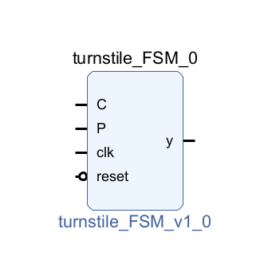
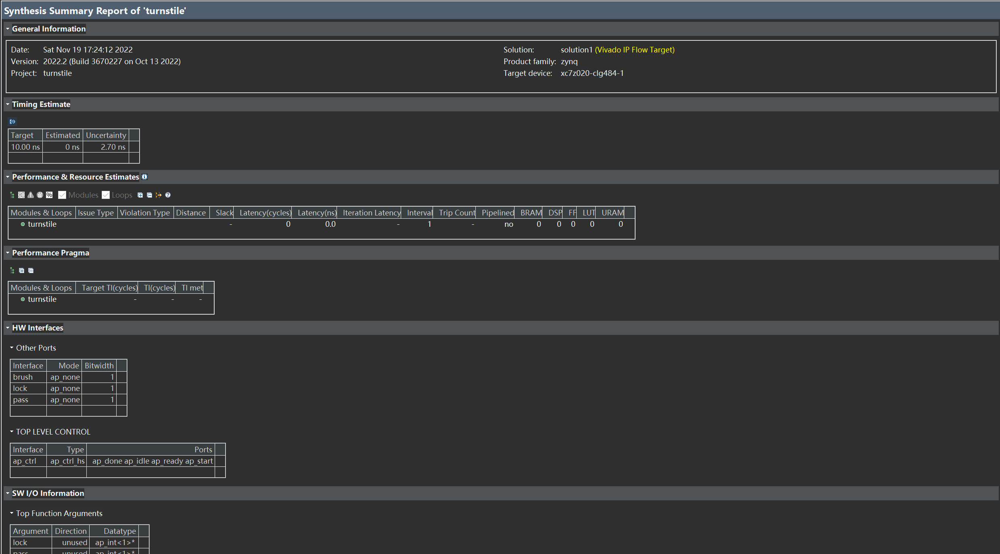
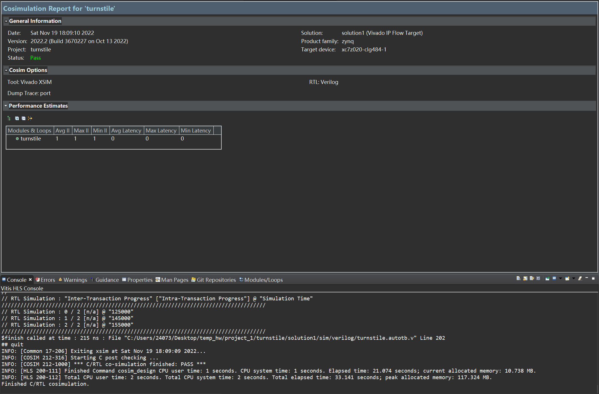
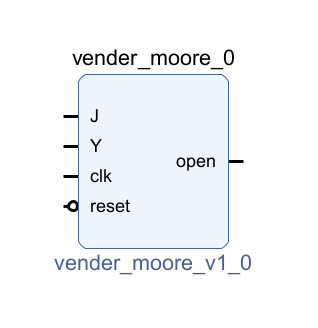
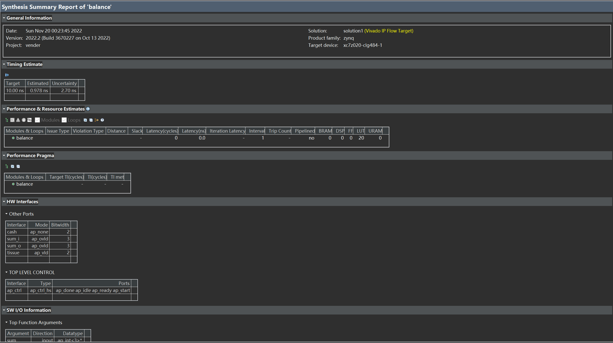
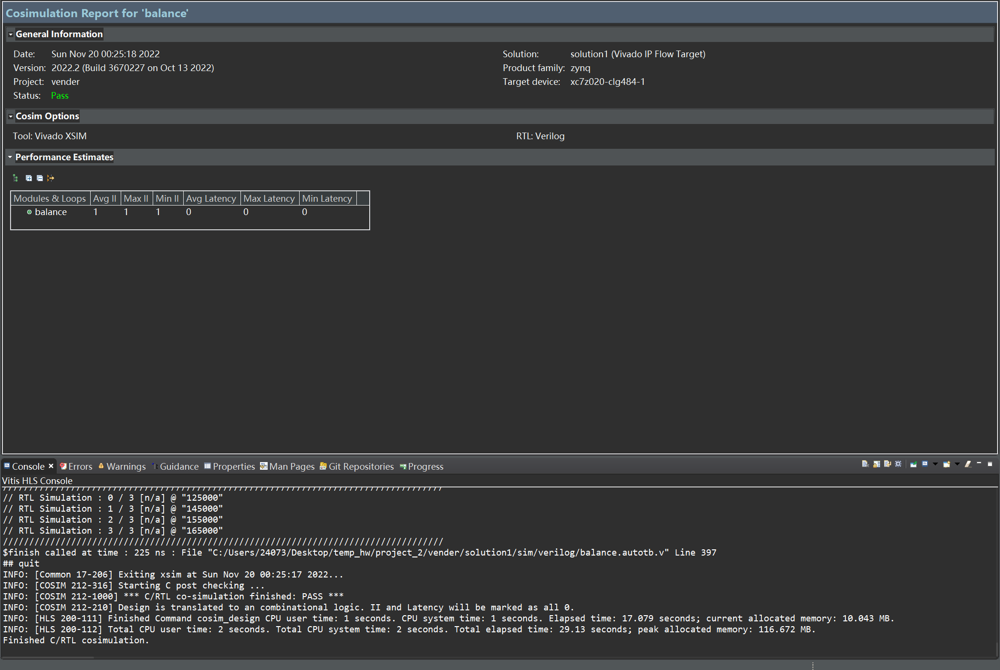

## 1. 自动旋转式栅门(Turnstile)

### 1.1 实验目的

- 对自动旋转式栅门进行建模仿真，使用Vivado工具生成IP核（Verilog版和图形版两种），同时与使用Verilog语言编程实现的Verilog代码进行比较，指明其相同性和差异性。

### 1.2 实验环境

- Vivado 2022.2
- Vitis HLS 2022.2

### 1.3 实验过程

- 图形化生成IP核

  - ```verilog
    module turnstile_FSM (C,P,clk,reset,y);
    //FSM for turnstile
    input C,P,clk,reset;
    output y;
    reg state;
    parameter S0=1'b0,S1=1'b1;
    // Define the turnstile block
    always @(posedge reset or posedge clk)
    begin
    	if(reset)
    		state<=S0; //initial state
    	else
    		case(state)
    			S0: if (C) state <=S1; else state <=S0;
    			S1: if (P) state <=S0; else state <=S1;
    		endcase
    end
    // Define output
    assign y = state;
    endmodule
    ```

  - 

- Verilog语言建模生成IP核

  - 函数声明

    - ```c++
      #include<ap_int.h>
      void turnstile(ap_int<1> *lock, ap_int<1> *pass, ap_int<1> *brush);
      ```

  - 函数功能实现

    - ```c++
      #include "turnstile.h"
      void turnstile(ap_int<1> *lock, ap_int<1> *pass, ap_int<1> *brush){
      #pragma HLS INTERFACE mode=ap_hs port=brush
      #pragma HLS INTERFACE mode=ap_hs port=pass
      #pragma HLS INTERFACE mode=ap_hs port=lock
      #pragma HLS INTERFACE mode=ap_ctrl_hs port=return
          if(*lock == 1 && *brush == 1){
              *lock = 0;
              *brush = 0;
          }
          else if(*lock == 0 && *pass == 1){
              *lock = 1;
              *pass = 0;
          }
      }
      
      ```

  - test bench

    - ```c++
      #include "turnstile.h"
      
      ap_int<1> lock = 1;
      ap_int<1> pass = 1;
      ap_int<1> brush = 1;
      
      int main(){
          turnstile(&lock, &pass, &brush);
          turnstile(&lock, &pass, &brush);
          return 0;
      }
      ```

  - C simulation结果

    - ```
      INFO: [SIM 2] *************** CSIM start ***************
      INFO: [SIM 4] CSIM will launch GCC as the compiler.
         Compiling ../../../../../project_1_src/turnstile_tb.cpp in debug mode
         Compiling ../../../../../project_1_src/turnstile.cpp in debug mode
         Generating csim.exe
      INFO: [SIM 1] CSim done with 0 errors.
      INFO: [SIM 3] *************** CSIM finish ***************
      ```

  - C synthesis结果

    - 

  - C/RTL cosimulation结果

    - 

  - 最终得到的Verilog

    - ```verilog
      // ==============================================================
      // RTL generated by Vitis HLS - High-Level Synthesis from C, C++ and OpenCL v2022.2 (64-bit)
      // Version: 2022.2
      // Copyright (C) Copyright 1986-2022 Xilinx, Inc. All Rights Reserved.
      // 
      // ===========================================================
      
      `timescale 1 ns / 1 ps 
      
      (* CORE_GENERATION_INFO="turnstile_turnstile,hls_ip_2022_2,{HLS_INPUT_TYPE=cxx,HLS_INPUT_FLOAT=0,HLS_INPUT_FIXED=0,HLS_INPUT_PART=xc7z020-clg484-1,HLS_INPUT_CLOCK=10.000000,HLS_INPUT_ARCH=others,HLS_SYN_CLOCK=0.000000,HLS_SYN_LAT=0,HLS_SYN_TPT=none,HLS_SYN_MEM=0,HLS_SYN_DSP=0,HLS_SYN_FF=1,HLS_SYN_LUT=0,HLS_VERSION=2022_2}" *)
      
      module turnstile (
              ap_clk,
              ap_rst,
              ap_start,
              ap_done,
              ap_idle,
              ap_ready,
              lock,
              lock_ap_vld,
              lock_ap_ack,
              pass,
              pass_ap_vld,
              pass_ap_ack,
              brush,
              brush_ap_vld,
              brush_ap_ack
      );
      
      parameter    ap_ST_fsm_state1 = 1'd1;
      
      input   ap_clk;
      input   ap_rst;
      input   ap_start;
      output   ap_done;
      output   ap_idle;
      output   ap_ready;
      input  [0:0] lock;
      input   lock_ap_vld;
      output   lock_ap_ack;
      input  [0:0] pass;
      input   pass_ap_vld;
      output   pass_ap_ack;
      input  [0:0] brush;
      input   brush_ap_vld;
      output   brush_ap_ack;
      
      reg ap_done;
      reg ap_idle;
      reg ap_ready;
      
      (* fsm_encoding = "none" *) reg   [0:0] ap_CS_fsm;
      wire    ap_CS_fsm_state1;
      reg   [0:0] ap_NS_fsm;
      reg    ap_ST_fsm_state1_blk;
      wire    ap_ce_reg;
      
      // power-on initialization
      initial begin
      #0 ap_CS_fsm = 1'd1;
      end
      
      always @ (posedge ap_clk) begin
          if (ap_rst == 1'b1) begin
              ap_CS_fsm <= ap_ST_fsm_state1;
          end else begin
              ap_CS_fsm <= ap_NS_fsm;
          end
      end
      
      always @ (*) begin
          if ((ap_start == 1'b0)) begin
              ap_ST_fsm_state1_blk = 1'b1;
          end else begin
              ap_ST_fsm_state1_blk = 1'b0;
          end
      end
      
      always @ (*) begin
          if (((ap_start == 1'b1) & (1'b1 == ap_CS_fsm_state1))) begin
              ap_done = 1'b1;
          end else begin
              ap_done = 1'b0;
          end
      end
      
      always @ (*) begin
          if (((ap_start == 1'b0) & (1'b1 == ap_CS_fsm_state1))) begin
              ap_idle = 1'b1;
          end else begin
              ap_idle = 1'b0;
          end
      end
      
      always @ (*) begin
          if (((ap_start == 1'b1) & (1'b1 == ap_CS_fsm_state1))) begin
              ap_ready = 1'b1;
          end else begin
              ap_ready = 1'b0;
          end
      end
      
      always @ (*) begin
          case (ap_CS_fsm)
              ap_ST_fsm_state1 : begin
                  ap_NS_fsm = ap_ST_fsm_state1;
              end
              default : begin
                  ap_NS_fsm = 'bx;
              end
          endcase
      end
      
      assign ap_CS_fsm_state1 = ap_CS_fsm[32'd0];
      
      assign brush_ap_ack = 1'b0;
      
      assign lock_ap_ack = 1'b0;
      
      assign pass_ap_ack = 1'b0;
      
      endmodule //turnstile
      ```

### 1.4 实验总结

- 使用C++语言得到Verilog语言的过程中，在进行C/RTL cosimulation的过程中，出现错误

  - ```
    ERROR: [COSIM 212-317] C++ compile error.
    ERROR: [COSIM 212-321] EXE file generate failed.
    ERROR: [COSIM 212-331] Aborting co-simulation: C simulation failed, compilation errors.
    ERROR: [COSIM 212-5] *** C/RTL co-simulation file generation failed. ***
    ERROR: [COSIM 212-4] *** C/RTL co-simulation finished: FAIL ***
    ```

  - 解决办法：[设置端口](http://t.csdn.cn/M3Zin)

- 可以看到，通过Vitis HLS自动生成的Verilog程序，相较于自己实现的Verilog程序，要更加臃肿一点，但同时也更加规范一点，可以看到C++源程序的雏形还在，只是换成了Verilog的表达形式

## 2. 餐巾纸售货机

### 2.1 实验目的

- 对餐巾纸售货机进行建模仿真，使用Vivado工具生成IP核（Verilog版和图形版两种），同时与使用Verilog语言编程实现的Verilog代码进行比较，指明其相同性和差异性。

### 2.2 实验环境

- Vivado 2022.2
- Vitis HLS 2022.2

### 2.3 实验过程

- 图形化生成IP核

  - ```verilog
    module vender_moore(J,Y,clk,reset,open);
    //Moore FSM for a vender
    input J,Y,clk,reset;
    output open;
    reg [2:0] state;
    parameter S0=3'b000,S5=3'b001,S10=3'b010,S15=3'b011,S20=3'b100;
    //Define the vender block
    always @(J or Y or state or reset)
    	if(reset) state<=S0;
    	else
    		case(state)
    			S0:if(J) state<=S5;
    				else if(Y) state<=S10;
    				else state<=S0;
    			S5:if(J) state<=S10;
    				else if(Y) state<=S15;
    				else state<=S5;
    			S10:if(J) state<=S15;
    				else if(Y) state<=S20;
    				else state<=S10;
    			S15:state<=S15;
    			S20:state<=S20;
    		endcase
    //Define output during S3
    assign open=(state==S15|| state==S20);
    endmodule
    ```

  - 

- Verilog语言建模生成IP核

  - 函数声明

    - ```c++
      #include <ap_int.h>
      void balance(ap_int<3> *sum, ap_int<2> cash, ap_int<2> *tissue);
      ```

  - 函数功能实现

    - ```c++
      #include "vender.h"
      void balance(ap_int<3> *sum, ap_int<2> cash, ap_int<2> *tissue){
      	if(*sum == 0){
      		switch(cash){
      		case 0:
      			*sum = 0;
      			break;
      		case 1:
      			*sum = 1;
      			break;
      		case 2:
      			*sum = 2;
      			break;
      		}
      	}
      	else if(*sum == 1){
      		switch(cash){
      		case 0:
      			*sum = 1;
      			break;
      		case 1:
      			*sum = 2;
      			break;
      		case 2:
      			*sum = 3;
      			*tissue = 1;
      			*sum = 0;
      			break;
      		}
      	}
      	else if(*sum == 2){
      		switch(cash){
      		case 0:
      			*sum = 2;
      			break;
      		case 1:
      			*sum = 3;
      			*tissue = 1;
      			*sum = 0;
      			break;
      		case 2:
      			*sum = 4;
      			*tissue = 1;
      			*sum = 0;	//无找零功能
      			break;
      		}
      	}
      }
      ```

  - test bench

    - ```c++
      #include "vender.h"
      
      ap_int<3> sum = 0;
      ap_int<2> cash = 1;
      ap_int<2> tissue = 0;
      
      int main(){
      	while(tissue != 1){
      		balance(&sum, cash, &tissue);
      	}
      	return 0;
      }
      ```

  - C simulation结果

    - ```
      INFO: [SIM 2] *************** CSIM start ***************
      INFO: [SIM 4] CSIM will launch GCC as the compiler.
      make: 'csim.exe' is up to date.
      INFO: [SIM 1] CSim done with 0 errors.
      INFO: [SIM 3] *************** CSIM finish ***************
      ```

  - C synthesis结果

    - 

  - C/RTL cosimulation结果

    - 

  - 最终得到的Verilog

    - ```verilog
      // ==============================================================
      // RTL generated by Vitis HLS - High-Level Synthesis from C, C++ and OpenCL v2022.2 (64-bit)
      // Version: 2022.2
      // Copyright (C) Copyright 1986-2022 Xilinx, Inc. All Rights Reserved.
      // 
      // ===========================================================
      
      `timescale 1 ns / 1 ps 
      
      (* CORE_GENERATION_INFO="balance_balance,hls_ip_2022_2,{HLS_INPUT_TYPE=cxx,HLS_INPUT_FLOAT=0,HLS_INPUT_FIXED=0,HLS_INPUT_PART=xc7z020-clg484-1,HLS_INPUT_CLOCK=10.000000,HLS_INPUT_ARCH=others,HLS_SYN_CLOCK=0.978000,HLS_SYN_LAT=0,HLS_SYN_TPT=none,HLS_SYN_MEM=0,HLS_SYN_DSP=0,HLS_SYN_FF=0,HLS_SYN_LUT=20,HLS_VERSION=2022_2}" *)
      
      module balance (
              ap_start,
              ap_done,
              ap_idle,
              ap_ready,
              sum_i,
              sum_o,
              sum_o_ap_vld,
              cash,
              tissue,
              tissue_ap_vld
      );
      
      
      input   ap_start;
      output   ap_done;
      output   ap_idle;
      output   ap_ready;
      input  [2:0] sum_i;
      output  [2:0] sum_o;
      output   sum_o_ap_vld;
      input  [1:0] cash;
      output  [1:0] tissue;
      output   tissue_ap_vld;
      
      reg[2:0] sum_o;
      reg sum_o_ap_vld;
      reg tissue_ap_vld;
      
      wire   [1:0] cash_read_read_fu_40_p2;
      wire   [2:0] sum_read_read_fu_46_p2;
      wire    ap_ce_reg;
      
      always @ (*) begin
          if ((((ap_start == 1'b1) & (sum_read_read_fu_46_p2 == 3'd0) & (cash_read_read_fu_40_p2 == 2'd1)) | ((ap_start == 1'b1) & (sum_read_read_fu_46_p2 == 3'd1) & (cash_read_read_fu_40_p2 == 2'd0)))) begin
              sum_o = 3'd1;
          end else if ((((ap_start == 1'b1) & (sum_read_read_fu_46_p2 == 3'd1) & (cash_read_read_fu_40_p2 == 2'd1)) | ((ap_start == 1'b1) & (sum_read_read_fu_46_p2 == 3'd2) & (cash_read_read_fu_40_p2 == 2'd0)))) begin
              sum_o = 3'd2;
          end else if ((((ap_start == 1'b1) & (sum_read_read_fu_46_p2 == 3'd0) & (cash_read_read_fu_40_p2 == 2'd0)) | ((ap_start == 1'b1) & (sum_read_read_fu_46_p2 == 3'd2) & (cash_read_read_fu_40_p2 == 2'd1)))) begin
              sum_o = 3'd0;
          end else begin
              sum_o = sum_i;
          end
      end
      
      always @ (*) begin
          if ((((ap_start == 1'b1) & (sum_read_read_fu_46_p2 == 3'd0) & (cash_read_read_fu_40_p2 == 2'd0)) | ((ap_start == 1'b1) & (sum_read_read_fu_46_p2 == 3'd0) & (cash_read_read_fu_40_p2 == 2'd1)) | ((ap_start == 1'b1) & (sum_read_read_fu_46_p2 == 3'd1) & (cash_read_read_fu_40_p2 == 2'd0)) | ((ap_start == 1'b1) & (sum_read_read_fu_46_p2 == 3'd1) & (cash_read_read_fu_40_p2 == 2'd1)) | ((ap_start == 1'b1) & (sum_read_read_fu_46_p2 == 3'd2) & (cash_read_read_fu_40_p2 == 2'd0)) | ((ap_start == 1'b1) & (sum_read_read_fu_46_p2 == 3'd2) & (cash_read_read_fu_40_p2 == 2'd1)))) begin
              sum_o_ap_vld = 1'b1;
          end else begin
              sum_o_ap_vld = 1'b0;
          end
      end
      
      always @ (*) begin
          if (((ap_start == 1'b1) & (sum_read_read_fu_46_p2 == 3'd2) & (cash_read_read_fu_40_p2 == 2'd1))) begin
              tissue_ap_vld = 1'b1;
          end else begin
              tissue_ap_vld = 1'b0;
          end
      end
      
      assign ap_done = ap_start;
      
      assign ap_idle = 1'b1;
      
      assign ap_ready = ap_start;
      
      assign cash_read_read_fu_40_p2 = cash;
      
      assign sum_read_read_fu_46_p2 = sum_i;
      
      assign tissue = 2'd1;
      
      endmodule //balance
      ```

### 2.4 实验总结

- 可以看到，通过Vitis HLS自动生成的Verilog程序，相较于自己实现的Verilog程序，要更加臃肿一点，但同时也更加规范一点，可以看到C++源程序的雏形还在，只是换成了Verilog的表达形式