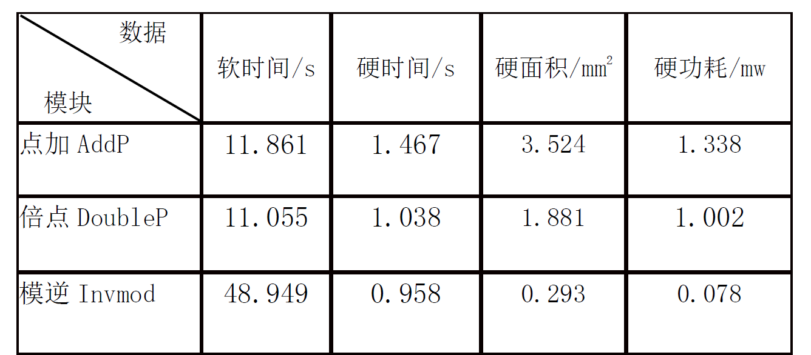
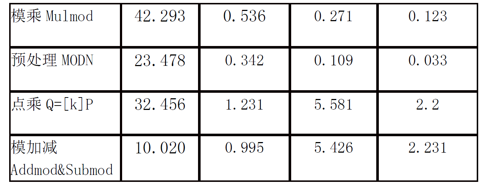
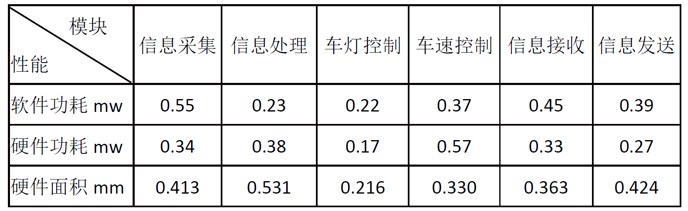
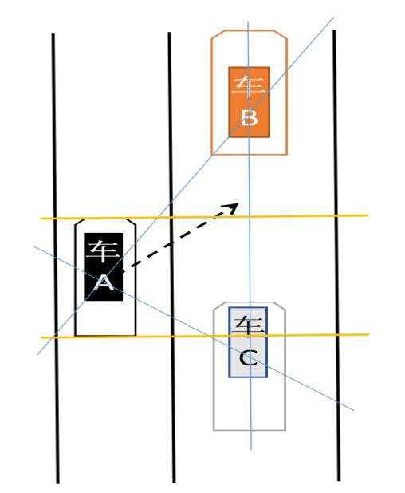

# 1 SM2加密算法软硬件划分

## 1.1 实验目的

- SM2加密算法每个步骤所需软硬件执行时间、面积及功耗如表，依据这些数据，系统要求最大硬功耗P=4.5mw，最大硬件面积S=12mm^2^，最大执行时间T=110s，使用线性规划方法进行软硬件划分，使得执行时间、硬件面积以及功耗的系统整体最小化，以及系统单个性能指标最小化，并求出相应的软硬件划分结果及其性能指标。
- 

## 1.2 实验环境

- LINGO

## 1.3 实验过程

- 设变量 $x_{ij}$ ($i=0...6, j=0, 1$)，分别对应点加、倍点、模逆、模乘、预处理、点乘、模加减，$j=0$ 表示软实现，$j=1$ 表示硬实现，表示第 $i$ 个任务是软实现还是硬实现，$t$ 表示时间， $s$ 表示硬面积，$p$ 表示硬功耗，$x_{ij}\in\{0, 1\}(i = 0...6, j = 0/1)$

- 变量空间：$x_{i0} + x_{i1} = 1$ 是变量 $x_{ij}$ 约束条件

- 约束条件：$t\le110$ ，$s\le12$ ，$p\le4.5$

- 整体最小化

  - ```
    model:
    min = t + s + p;
    t = 11.861*x00 + 1.476*x01 + 11.055*x10 + 1.038*x11 + 48.949*x20 + 0.958*x21 + 42.293*x30 + 0.536*x31 + 23.478*x40 + 0.342*x41 + 32.456*x50 + 1.231*x51 + 10.020*x60 + 0.995*x61;
    s = 3.524*x01 + 1.881*x11 + 0.293*x21 + 0.271*x31 + 0.109*x41 + 5.581*x51 + 5.426*x61;
    p = 1.338*x01 + 1.002*x11 + 0.078*x21 + 0.123*x31 + 0.033*x41 + 2.2*x51 + 2.231*x61;
    x00 + x01 = 1;
    x10 + x11 = 1;
    x20 + x21 = 1;
    x30 + x31 = 1;
    x40 + x41 = 1;
    x50 + x51 = 1;
    x60 + x61 = 1;
    @bin(x00);
    @bin(x01);
    @bin(x10);
    @bin(x11);
    @bin(x20);
    @bin(x21);
    @bin(x30);
    @bin(x31);
    @bin(x40);
    @bin(x41);
    @bin(x50);
    @bin(x51);
    @bin(x60);
    @bin(x61);
    p <= 4.5;
    s <= 12;
    t <= 110;
    end
    ```

- 执行时间最小化

  - ```
    model:
    min = t;
    t = 11.861*x00 + 1.476*x01 + 11.055*x10 + 1.038*x11 + 48.949*x20 + 0.958*x21 + 42.293*x30 + 0.536*x31 + 23.478*x40 + 0.342*x41 + 32.456*x50 + 1.231*x51 + 10.020*x60 + 0.995*x61;
    s = 3.524*x01 + 1.881*x11 + 0.293*x21 + 0.271*x31 + 0.109*x41 + 5.581*x51 + 5.426*x61;
    p = 1.338*x01 + 1.002*x11 + 0.078*x21 + 0.123*x31 + 0.033*x41 + 2.2*x51 + 2.231*x61;
    x00 + x01 = 1;
    x10 + x11 = 1;
    x20 + x21 = 1;
    x30 + x31 = 1;
    x40 + x41 = 1;
    x50 + x51 = 1;
    x60 + x61 = 1;
    @bin(x00);
    @bin(x01);
    @bin(x10);
    @bin(x11);
    @bin(x20);
    @bin(x21);
    @bin(x30);
    @bin(x31);
    @bin(x40);
    @bin(x41);
    @bin(x50);
    @bin(x51);
    @bin(x60);
    @bin(x61);
    p <= 4.5;
    s <= 12;
    t <= 110;
    end
    ```

- 硬面积最小化

  - ```
    model:
    min = s;
    t = 11.861*x00 + 1.476*x01 + 11.055*x10 + 1.038*x11 + 48.949*x20 + 0.958*x21 + 42.293*x30 + 0.536*x31 + 23.478*x40 + 0.342*x41 + 32.456*x50 + 1.231*x51 + 10.020*x60 + 0.995*x61;
    s = 3.524*x01 + 1.881*x11 + 0.293*x21 + 0.271*x31 + 0.109*x41 + 5.581*x51 + 5.426*x61;
    p = 1.338*x01 + 1.002*x11 + 0.078*x21 + 0.123*x31 + 0.033*x41 + 2.2*x51 + 2.231*x61;
    x00 + x01 = 1;
    x10 + x11 = 1;
    x20 + x21 = 1;
    x30 + x31 = 1;
    x40 + x41 = 1;
    x50 + x51 = 1;
    x60 + x61 = 1;
    @bin(x00);
    @bin(x01);
    @bin(x10);
    @bin(x11);
    @bin(x20);
    @bin(x21);
    @bin(x30);
    @bin(x31);
    @bin(x40);
    @bin(x41);
    @bin(x50);
    @bin(x51);
    @bin(x60);
    @bin(x61);
    p <= 4.5;
    s <= 12;
    t <= 110;
    end
    ```

- 硬功耗最小化

  - ```
    model:
    min = p;
    t = 11.861*x00 + 1.476*x01 + 11.055*x10 + 1.038*x11 + 48.949*x20 + 0.958*x21 + 42.293*x30 + 0.536*x31 + 23.478*x40 + 0.342*x41 + 32.456*x50 + 1.231*x51 + 10.020*x60 + 0.995*x61;
    s = 3.524*x01 + 1.881*x11 + 0.293*x21 + 0.271*x31 + 0.109*x41 + 5.581*x51 + 5.426*x61;
    p = 1.338*x01 + 1.002*x11 + 0.078*x21 + 0.123*x31 + 0.033*x41 + 2.2*x51 + 2.231*x61;
    x00 + x01 = 1;
    x10 + x11 = 1;
    x20 + x21 = 1;
    x30 + x31 = 1;
    x40 + x41 = 1;
    x50 + x51 = 1;
    x60 + x61 = 1;
    @bin(x00);
    @bin(x01);
    @bin(x10);
    @bin(x11);
    @bin(x20);
    @bin(x21);
    @bin(x30);
    @bin(x31);
    @bin(x40);
    @bin(x41);
    @bin(x50);
    @bin(x51);
    @bin(x60);
    @bin(x61);
    p <= 4.5;
    s <= 12;
    t <= 110;
    end
    ```


## 1.4 实验结论

- 整体最小化：
  - 划分解：$x_{00}=x_{11}=x_{21}=x_{31}=x_{41}=x_{51}=x_{60}=1$，$x_{01}=x_{10}=x_{20}=x_{30}=x_{40}=x_{50}=x_{61}=0$
    - 软件实现：任务0、6，对应点加、模加减

    - 硬件实现：任务1、2、3、4、5，对应倍点、模逆、模乘、预处理、点乘
  - 划分效果 ：$t=25.986$ ，$s=8.135$ ，$p=3.436$，$min=t+s+p=37.557$
- 执行时间最小化：
  - 划分解：$x_{01}=x_{10}=x_{21}=x_{31}=x_{41}=x_{51}=x_{60}=1$，$x_{00}=x_{11}=x_{20}=x_{30}=x_{40}=x_{50}=x_{61}=0$
    - 软件实现：任务1、6，对应倍点、模加减

    - 硬件实现：任务0、2、3、4、5，对应点加、模逆、模乘、预处理、点乘
  - 划分效果 ：$t=25.618$ ，$s=9.778$ ，$p=3.772$，$min=t=25.618$
- 硬面积最小化：
  - 划分解：$x_{00}=x_{10}=x_{21}=x_{30}=x_{41}=x_{50}=x_{60}=1$，$x_{01}=x_{11}=x_{20}=x_{31}=x_{40}=x_{51}=x_{61}=0$
    - 软件实现：任务0、1、3、5、6，对应点加、倍点、模乘、点乘、模加减

    - 硬件实现：任务2、4，对应模逆、预处理
  - 划分效果 ：$t=108.985$ ，$s=0.402$ ，$p=0.111$，$min=s=0.402$
- 硬功耗最小化：
  - 划分解：$x_{00}=x_{10}=x_{21}=x_{30}=x_{41}=x_{50}=x_{60}=1$，$x_{01}=x_{11}=x_{20}=x_{31}=x_{40}=x_{51}=x_{61}=0$
    - 软件实现：任务0、1、3、5、6，对应点加、倍点、模乘、点乘、模加减

    - 硬件实现：任务2、4，对应模逆、预处理
  - 划分效果 ：$t=108.985$ ，$s=0.402$ ，$p=0.111$，$min=p=0.111$

# 2 车辆自动变道系统

## 2.1 实验目的

- 矩形分别代表车辆A、B、C（每辆上装有通讯设备和用于信息采集的传感器），车身长度为图中所示两条红线之间的距离。当车辆A要向右进行变道时，先向车辆B、C发送变道请求，打开右转向灯，并收集车辆B、C此时的车速、加速度、线段AB、AC与平行法线的夹角和距车辆A的距离（即线段AB和AC），若车辆B、C成功收到请求并将收到信息成功反馈给车辆A，则车辆A查看此时道路环境是否满足变道要求，若满足则进行变道，否则重新发送请求。车辆A进行变道时，该系统会控制车辆B不能减速，车辆C不能加速。该自动变道系统由信息采集模块、信息处理模块、车灯控制模块、车速控制模块、信息接收模块、信息发送模块组成。每个模块有软件执行功耗、硬件执行功耗和硬件执行面积。使用线性规划方法给出两种解决方案：第一种在硬件面积不超过1.5mm^2^、1.8mm^2^、2.0mm^2^前提下功耗最小解决方案；第二种在整体功耗不超过2mw、2.2mw、2.5mw前提下，硬件面积最小的解决方案。
- 
- 

## 2.2 实验环境

- LINGO

## 2.3 实验过程

- 设变量 $x_{ij}$ ($i=0...5, j=0, 1$)，分别对应信息采集、信息处理、车灯控制、车速控制、信息接受、信息发送，$j=0$ 表示软实现，$j=1$ 表示硬实现，表示第 $i$ 个任务是软实现还是硬实现， $s$ 表示硬件面积，$p$ 表示功耗，$x_{ij}\in\{0, 1\}(i = 0...5, j = 0/1)$

- 变量空间：$x_{i0} + x_{i1} = 1$ 是变量 $x_{ij}$ 约束条件

- 约束条件：$t\le110$ ，$s\le12$ ，$p\le4.5$

- 硬件面积

  - 不超过1.5mm^2^，功耗最小

    - ```
      model:
      min = p;
      p = 0.55*x00 + 0.34*x01 + 0.23*x10 + 0.38*x11 + 0.22*x20 + 0.17*x21 + 0.37*x30 + 0.57*x31 + 0.45*x40 + 0.33*x41 + 0.39*x50 + 0.27*x51;
      s = 0.413*x01 + 0.531*x11 + 0.216*x21 + 0.330*x31 + 0.363*x41 + 0.424*x51;
      x00 + x01 = 1;
      x10 + x11 = 1;
      x20 + x21 = 1;
      x30 + x31 = 1;
      x40 + x41 = 1;
      x50 + x51 = 1;
      @bin(x00);
      @bin(x01);
      @bin(x10);
      @bin(x11);
      @bin(x20);
      @bin(x21);
      @bin(x30);
      @bin(x31);
      @bin(x40);
      @bin(x41);
      @bin(x50);
      @bin(x51);
      s <= 1.5;
      end
      ```

  - 不超过1.8mm^2^，功耗最小

    - ```
      model:
      min = p;
      p = 0.55*x00 + 0.34*x01 + 0.23*x10 + 0.38*x11 + 0.22*x20 + 0.17*x21 + 0.37*x30 + 0.57*x31 + 0.45*x40 + 0.33*x41 + 0.39*x50 + 0.27*x51;
      s = 0.413*x01 + 0.531*x11 + 0.216*x21 + 0.330*x31 + 0.363*x41 + 0.424*x51;
      x00 + x01 = 1;
      x10 + x11 = 1;
      x20 + x21 = 1;
      x30 + x31 = 1;
      x40 + x41 = 1;
      x50 + x51 = 1;
      @bin(x00);
      @bin(x01);
      @bin(x10);
      @bin(x11);
      @bin(x20);
      @bin(x21);
      @bin(x30);
      @bin(x31);
      @bin(x40);
      @bin(x41);
      @bin(x50);
      @bin(x51);
      s <= 1.8;
      end
      ```

  - 不超过2.0mm^2^，功耗最小

    - ```
      model:
      min = p;
      p = 0.55*x00 + 0.34*x01 + 0.23*x10 + 0.38*x11 + 0.22*x20 + 0.17*x21 + 0.37*x30 + 0.57*x31 + 0.45*x40 + 0.33*x41 + 0.39*x50 + 0.27*x51;
      s = 0.413*x01 + 0.531*x11 + 0.216*x21 + 0.330*x31 + 0.363*x41 + 0.424*x51;
      x00 + x01 = 1;
      x10 + x11 = 1;
      x20 + x21 = 1;
      x30 + x31 = 1;
      x40 + x41 = 1;
      x50 + x51 = 1;
      @bin(x00);
      @bin(x01);
      @bin(x10);
      @bin(x11);
      @bin(x20);
      @bin(x21);
      @bin(x30);
      @bin(x31);
      @bin(x40);
      @bin(x41);
      @bin(x50);
      @bin(x51);
      s <= 2.0;
      end
      ```

- 整体功耗

  - 不超过2mw，硬件面积最小

    - ```
      model:
      min = s;
      p = 0.55*x00 + 0.34*x01 + 0.23*x10 + 0.38*x11 + 0.22*x20 + 0.17*x21 + 0.37*x30 + 0.57*x31 + 0.45*x40 + 0.33*x41 + 0.39*x50 + 0.27*x51;
      s = 0.413*x01 + 0.531*x11 + 0.216*x21 + 0.330*x31 + 0.363*x41 + 0.424*x51;
      x00 + x01 = 1;
      x10 + x11 = 1;
      x20 + x21 = 1;
      x30 + x31 = 1;
      x40 + x41 = 1;
      x50 + x51 = 1;
      @bin(x00);
      @bin(x01);
      @bin(x10);
      @bin(x11);
      @bin(x20);
      @bin(x21);
      @bin(x30);
      @bin(x31);
      @bin(x40);
      @bin(x41);
      @bin(x50);
      @bin(x51);
      p <= 2;
      end
      ```

  - 不超过2.2mw，硬件面积最小

    - ```
      model:
      min = s;
      p = 0.55*x00 + 0.34*x01 + 0.23*x10 + 0.38*x11 + 0.22*x20 + 0.17*x21 + 0.37*x30 + 0.57*x31 + 0.45*x40 + 0.33*x41 + 0.39*x50 + 0.27*x51;
      s = 0.413*x01 + 0.531*x11 + 0.216*x21 + 0.330*x31 + 0.363*x41 + 0.424*x51;
      x00 + x01 = 1;
      x10 + x11 = 1;
      x20 + x21 = 1;
      x30 + x31 = 1;
      x40 + x41 = 1;
      x50 + x51 = 1;
      @bin(x00);
      @bin(x01);
      @bin(x10);
      @bin(x11);
      @bin(x20);
      @bin(x21);
      @bin(x30);
      @bin(x31);
      @bin(x40);
      @bin(x41);
      @bin(x50);
      @bin(x51);
      p <= 2.2;
      end
      ```

  - 不超过2.5mw，硬件面积最小

    - ```
      model:
      min = s;
      p = 0.55*x00 + 0.34*x01 + 0.23*x10 + 0.38*x11 + 0.22*x20 + 0.17*x21 + 0.37*x30 + 0.57*x31 + 0.45*x40 + 0.33*x41 + 0.39*x50 + 0.27*x51;
      s = 0.413*x01 + 0.531*x11 + 0.216*x21 + 0.330*x31 + 0.363*x41 + 0.424*x51;
      x00 + x01 = 1;
      x10 + x11 = 1;
      x20 + x21 = 1;
      x30 + x31 = 1;
      x40 + x41 = 1;
      x50 + x51 = 1;
      @bin(x00);
      @bin(x01);
      @bin(x10);
      @bin(x11);
      @bin(x20);
      @bin(x21);
      @bin(x30);
      @bin(x31);
      @bin(x40);
      @bin(x41);
      @bin(x50);
      @bin(x51);
      p <= 2.5;
      end
      ```

## 2.4 实验结论

- 硬件面积
  - 不超过1.5mm^2^，功耗最小
    - 划分解：$x_{01}=x_{10}=x_{21}=x_{30}=x_{41}=x_{51}=1$，$x_{00}=x_{11}=x_{20}=x_{31}=x_{40}=x_{50}=0$
      - 软件实现：任务1、3，对应信息处理、车速控制

      - 硬件实现：任务0、2、4、5，对应信息采集、车灯控制、信息接受、信息发送
    - 划分效果 ：$s=1.416$ ，$p=1.71$，$min=p=1.71$
  - 不超过1.8mm^2^，功耗最小
    - 划分解：$x_{01}=x_{10}=x_{21}=x_{30}=x_{41}=x_{51}=1$，$x_{00}=x_{11}=x_{20}=x_{31}=x_{40}=x_{50}=0$
      - 软件实现：任务1、3，对应信息处理、车速控制

      - 硬件实现：任务0、2、4、5，对应信息采集、车灯控制、信息接受、信息发送
    - 划分效果 ：$s=1.416$ ，$p=1.71$，$min=p=1.71$
  - 不超过2.0mm^2^，功耗最小
    - 划分解：$x_{01}=x_{10}=x_{21}=x_{30}=x_{41}=x_{51}=1$，$x_{00}=x_{11}=x_{20}=x_{31}=x_{40}=x_{50}=0$
      - 软件实现：任务1、3，对应信息处理、车速控制

      - 硬件实现：任务0、2、4、5，对应信息采集、车灯控制、信息接受、信息发送
    - 划分效果 ：$s=1.416$ ，$p=1.71$，$min=p=1.71$
- 整体功耗
  - 不超过2mw，硬件面积最小
    - 划分解：$x_{01}=x_{10}=x_{20}=x_{30}=x_{40}=x_{50}=1$，$x_{00}=x_{11}=x_{21}=x_{31}=x_{41}=x_{51}=0$
      - 软件实现：任务1、2、3、4、5，对应信息处理、车灯控制、车速控制、信息接受、信息发送

      - 硬件实现：任务0，对应信息采集
    - 划分效果 ：$s=0.413$ ，$p=2$，$min=s=0.413$
  - 不超过2.2mw，硬件面积最小
    - 划分解：$x_{00}=x_{10}=x_{21}=x_{30}=x_{40}=x_{50}=1$，$x_{01}=x_{11}=x_{20}=x_{31}=x_{41}=x_{51}=0$
      - 软件实现：任务0、1、3、4、5，对应信息采集、信息处理、车速控制、信息接受、信息发送

      - 硬件实现：任务2，对应车灯控制
    - 划分效果 ：$s=0.216$ ，$p=2.16$，$min=s=0.216$
  - 不超过2.5mw，硬件面积最小
    - 划分解：$x_{00}=x_{10}=x_{20}=x_{30}=x_{40}=x_{50}=1$，$x_{01}=x_{11}=x_{21}=x_{31}=x_{41}=x_{51}=0$
      - 软件实现：任务0、1、2、3、4、5，对应信息采集、信息处理、车灯控制、车速控制、信息接受、信息发送

      - 硬件实现：无任务
    - 划分效果 ：$s=0$ ，$p=2.21$，$min=s=0$
