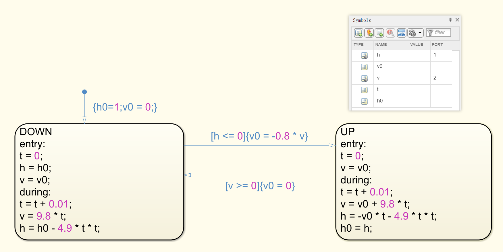

## 1、使用Simulink对汽车自动停车系统进行仿真

### 1.1、目的和要求

> 汽车自动停车系统按照汽车分成三个阶段进行，第一阶段是匀减速行驶， 减速的加速度是dv/dt=-1.35（米/秒平方），当车速到达每小时20公里速度时，进入第二阶段，第二阶段也是减速行驶，减速的加速度是dv/dt=0.09t-4.36（米/秒平方），当车速到达为零时，汽车进入第三阶段，停车。车速初始速度为100公里/小时。将建模与仿真结果写成实验报告。此题注意量纲的一致性。

### 1.2、使用环境

- **matlab**

### 1.3、实验过程

- **建模**
  - 离散状态集 Q = {UD, SD, STOP}
    - UD: 匀减速
    - SD: 减速
    - STOP: 停车

  - 连续状态集 X = R^2^，连续变量 x 是二维向量 (v, s)，其中 v 表示汽车的速度，s 表示汽车的位移，它们都是关于时间 t 的函数
  - 向量场函数 F( · , · ) : {UD, SD, STOP} × X → R^2^:
    - F(UD, x) = (dv/dt = -1.35, ds/dt = v~0~ - 1.35t)，匀减速行驶
    - F(SD,  x) = (dv/dt = 0.09t - 4.36, ds/st = 0.045t^2^ - 4.36t + 5.56)，变减速行驶
    - F(STOP, x) = (dv/dt = 0, ds/dt = 0)，停车
  - 初始状态集 Init: {UD} × {v, s ∈ R|v = 27.78, s= 0S}
  - 域函数 Dom( · ) : Q → P(X) 定义为：
    - Dom(UD) = {v > 5.56}，规定匀减速状态速度不低于20km/h
    - Dom(SD) = {0 < v ≤ 5.56}，规定减速状态速度不低于0km/h，不超过20km/h
    - Dom(STOP) = {v = 0}，规定停车状态速度为0km/h
  - 边集 E $\subseteq$ Q × Q：
    - UD→SD
    - SD→STOP
  - 转换条件 G( · ) : E → P(X)：
    - G(UD→SD) = {v ≤ 5.56}，从匀减速状态转化到减速状态的条件是速度不超过20km/h
    - G(SD→STOP) = {v = 0}，从减速状态转化到停车状态的条件是速度为0km/h
  - 重置映射 R( · , · ) : E × X → P(X)：
    - 为每条边指定空值，即没有重置动作，保留转换状态之前的速度和行驶距离
  - 

- **仿真**
  - stateflow 模型
    - 
  - simulink 模型
    - 

### 1.4、仿真结果

- 

### 1.5、实验结论

- 为了精细化时间带来的速度影响，选择了时间步长为 0.01，当步长为 1 时，会出现达到状态转移条件仍然不转移的情况。
- 仿真结果图中，红色是速度曲线，可以看到速度的下降经历了三个状态，分别对应我们的匀减速、减速和停车，由于减速状态时间过短，所以看不出其中出现了变减速的状态。
- 仿真结果图中，蓝色是位移曲线，可以看到当进入停车状态后，速度为零，位移也不再增加，而且，随着速度的降低，相同时间内，位移也不断减少。

## 2、弹跳球运动模型

### 2.1、目的和要求

> 让球体在高度h处放下做自由落体运动，当落地时受到下落力作用，球会弹起，速度损失20%，到最高处又会受到地球引力作用做自由落体运动，这样反复落-弹运动，直到球落地不再弹起为止。建立弹跳球运动系统的Simulink模型，并对参数h分别等于100厘米和200厘米进行仿真，将建模和仿真结果写成实验报告。

### 2.2、使用环境

- **matlab**

### 2.3、实验过程

- **建模**
  - 离散状态集 Q = {UP, DOWN}
    - UP: 上升
    - DOWN: 下落

  - 连续状态集 X = R^2^，连续变量 x 是二维向量 (v, h)，其中 h 表示球体的高度，v 表示球体的高度，它们都是关于时间 t 的函数
    - v 正负表方向，下落为正

  - 向量场函数 F( · , · ) : {UP, DOWN} × X → R^2^:
    - F(DOWN, x) = (dv/dt = 9.8, dh/dt = 9.8t)，球体下落
    - F(UP, x) = (dv/dt = 9.8, dh/dt = v~0~ - 9.8t)，球体上升
  - 初始状态集 Init: {DOWN} × {v, h∈R|v = 0, h = {1, 2}}
  - 域函数 Dom( · ) : Q → P(X) 定义为：
    - Dom(DOWN) = {0 ≤ v ≤ $\sqrt{2gH}$, 0 ≤ h ≤ H}，规定下落时速度为正
    - Dom(UP) = {$-\sqrt{2gH}$ < v ≤ 0, 0 ≤ h < H}，规定反弹时速度为负
  - 边集 E $\subseteq$ Q × Q：
    - DOWN→UP
    - UP→DOWN
  - 转换条件 G( · ) : E → P(X)：
    - G(DOWN→UP) = {h = 0}，从落状态转化到升状态的条件是高度为0
    - G(UP→DOWN) = {v = 0}，从升状态转化到落状态的条件是上升速度为正
  - 重置映射 R( · , · ) : E × X → P(X)：
    - R(DOWN→UP, x) = {v := -0.8v}，从落状态转化为升状态时，需要重置速度损失20%，且速度方向改变

  - 

- **仿真**
  - stateflow 模型
    - 100cm
      - 
    - 200cm
      - 
  - simulink 模型
    - 

### 2.4、仿真结果

- 100cm
  - 
- 200cm
  - 

### 2.5、实验结论

- 为了精细化时间带来的速度影响，选择了时间步长为 0.01，当步长为 1 时，会出现达到状态转移条件仍然不转移的情况。
- 仿真结果图中，红色是小球离地面的高度，可以看到小球会从高点掉落地面，并反弹到新的高点，循环下去，由于在反弹过程中，动能会有损耗，所以在图中，可以明显看到，每次回弹的最高点都要远低于上一次的最高点。
- 仿真结果图中，蓝色是小球速度曲线，可以看到小球在上升过程中，动能没有损耗，但是，在接触地面后回弹，速度会损失80%，建模符合实验要求，并且，受到速度的影响，小球的回弹高度也发生明显变化。